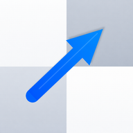
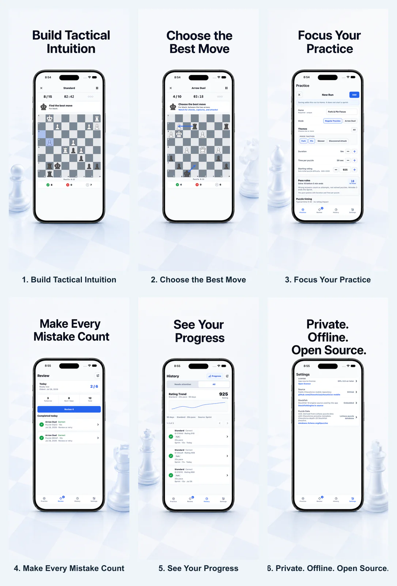

<p align="center">
  
</p>

<h1 align="center">Chessticize</h1>

<p align="center">
  <strong>A private, offline-first chess puzzle trainer for iPhone, iPad, and Android.</strong><br>
  Solve rating-matched puzzle Sprints, compare moves in Arrow Duel, build your own
  Custom Runs, and bring missed puzzles back through scheduled Review.
</p>

<p align="center">
  <a href="https://apps.apple.com/us/app/chessticize/id6788610123">Download on the App Store</a>
  ·
  <a href="https://chessticize.github.io/chessticize-mobile/">Visit the website</a>
  ·
  <a href="https://chessticize.github.io/chessticize-mobile/android/">Get the Android app</a>
</p>



## For chess players

- **Practice concrete puzzles:** short, rating-matched Puzzle Sprints keep each session focused.
- **Choose deliberately:** Arrow Duel asks you to compare the best move with a tempting alternative.
- **Control the next Run:** choose puzzle themes, pace, duration, and difficulty yourself.
- **Revisit the right puzzles:** missed and unclear puzzles return through scheduled Review.
- **Keep practice private:** no ads, no Chessticize account, no analytics, and no developer data collection.
- **Use and inspect it freely:** the app and its bundled Stockfish integration are open source.

Install from the links above, review the current
[accessibility support](https://chessticize.github.io/chessticize-mobile/accessibility/),
visit the [support page](https://chessticize.github.io/chessticize-mobile/support/),
or [report a problem or request a feature](https://github.com/Chessticize/chessticize-mobile/issues).

## For contributors

The repository contains the React Native app shell (`apps/mobile`), the
browser-based Interaction Lab (`apps/mobile-lab`), a pure TypeScript domain
core (`packages/core`), storage services (`packages/storage`), a stdio CLI
harness (`apps/cli`), and bundled puzzle fixtures (`fixtures/puzzles`).

## Documents

- [Mobile UI Design](docs/ui-design/MOBILE_UI_DESIGN.md) — authoritative screen behavior and visual spec
- [Core Library And CLI](docs/CORE_CLI.md) — backend package layout and CLI harness
- [Testing Architecture](docs/TESTING_ARCHITECTURE.md) — test-layer responsibilities, critical E2E regression scope, and SQLite migration compatibility design
- [Storybook Deployment](docs/STORYBOOK_DEPLOYMENT.md) — branch-isolated Vercel previews and the maintained `main` catalog
- [App Store Plan](docs/APP_STORE_PLAN.md) — historical first-release foundation plan
- [App Store Assets](docs/STORE_ASSETS.md) — current App Store metadata and screenshot capture plan
- [Accessibility Audit](docs/ACCESSIBILITY_AUDIT.md) — evidence-backed iPhone and iPad accessibility declaration decisions
- [App Store Screenshot Story](docs/marketing/APP_STORE_SCREENSHOT_STORY.md) — canonical six-frame marketing sequence, copy, and fictional-user contract
- [Landing Page](docs/LANDING_PAGE.md) — public routes, static deployment, marketing images, and install-link updates
- [Mobile Versioning](docs/RELEASE_VERSIONING.md) — separate development targets, release identities, and bump timing
- [Release Notes](docs/RELEASE_NOTES.md) — per-binary customer-facing notes, review, and publication contract
- [App Store Upload](docs/APP_STORE_UPLOAD.md) — owner-executed archive and App Store Connect upload runbook
- [TestFlight Diagnostics](docs/TESTFLIGHT_QA.md) — optional post-build device diagnostics and evidence log
- [Privacy Policy](docs/PRIVACY_POLICY.md) — current data, user-controllable iCloud Sync, Android backup, and tracking disclosure
- [iOS Development Build](docs/IOS_DEVELOPMENT_BUILD.md) — isolated Dev install, Development CloudKit setup, and dual-identity simulator E2E
- [iOS Device Targets](docs/DEVICE_TARGETS.md) — iPhone portrait and adaptive iPad/window release target
- [Android Validation](docs/ANDROID_VALIDATION.md) — exact-head API, adaptive, backup, and optional hardware-diagnostic evidence contract
- [UI Flow Design Gate](docs/agents/ui-flow-design.md) — required Storybook-first approval workflow for new UI flows
- [Android Play Release](docs/ANDROID_PLAY_RELEASE.md) — signed AAB and owner-only Play readiness runbook
- [Android Play Listing](docs/ANDROID_PLAY_LISTING.md) — truthful English listing, device, permission, privacy, and Data safety contract
- [Agent Instructions](AGENTS.md) — architecture boundary, testing philosophy, and PR workflow
- [Claude Instructions](CLAUDE.md) — symlink alias to the shared repository agent instructions

## Current Implementation

The repository now includes the GUI-independent backend core, a plain stdio CLI, and the first React Native practice UI:

- `packages/core` contains sprint, puzzle, Arrow Duel, ELO, and review scheduling rules.
- `packages/storage` contains real SQLite migrations and repositories for puzzles, attempts, sprint sessions, ratings, history filters, and review queues.
- `apps/cli` exposes the core through a machine-readable JSONL protocol for E2E testing without a mobile simulator.
- `apps/mobile` contains the React Native app shell and Practice screen that reuses `react-native-chessboard`.
- `apps/mobile-lab` renders those real React Native components through React Native Web for fast, deterministic design review.

## Mobile Interaction Lab Preview

For browser-based UI proposals and flow review, validate the Interaction Lab
without starting a local Storybook server:

```sh
pnpm mobile:lab:validate
```

New UI flows are Storybook-first. Before production navigation, backend,
storage, native-module, analytics, or rollout wiring begins, publish the
interactive design slice in the Interaction Lab and record explicit design
approval. See [UI Flow Design Gate](docs/agents/ui-flow-design.md).

Every requested Storybook design resets the previous `new` markers, pushes an
issue-scoped branch and PR, and waits for GitHub Actions to publish that
branch's Vercel preview. Use the hosted manager and direct story URLs for
review; do not use localhost or a LAN URL as the review surface. The lab uses
deterministic in-memory data and a clearly marked Board Placeholder; it does
not read local SQLite or replace native simulator/device acceptance.

For normal UI work, do not use the iOS simulator as the default validation loop. Run component tests and type checks first:

```sh
pnpm mobile:test
pnpm mobile:typecheck
```

To try the current app locally on iOS after Xcode and an iOS simulator runtime are installed:

```sh
cd /Users/shuz/Projects/Chessticize/chessticize-mobile
pnpm install
pnpm --filter ChessticizeMobile start -- --host 127.0.0.1 --port 8081
```

In a second terminal, replace the simulator name with one installed on your machine:

```sh
cd /Users/shuz/Projects/Chessticize/chessticize-mobile
pnpm --filter ChessticizeMobile ios --terminal dumb --no-packager --simulator "iPhone 15"
```

Use the simulator only for native behavior or final GUI checks: real gesture rendering, safe areas, Skia/chessboard rendering, animation, native module behavior, iOS build issues, Detox, or critical end-to-end acceptance.

## Support

For app issues, general feedback, or feature requests, use
https://github.com/Chessticize/chessticize-mobile/issues. For private support,
email support@chessticize.com.

## Product Direction

- Offline-first practice app with one shared product UI on iOS and Android.
- Puzzle Sprint, Arrow Duel, mistake review, spaced repetition, local ELO, history filters, and default-enabled user-controllable iCloud sync for progress across Apple devices.
- Reuse an existing chessboard component instead of maintaining a custom board widget.
- Embed Stockfish for offline analysis under GPL-compatible licensing.
- Keep frontend UI code separate from a solid local backend/domain core so business logic is reusable and heavily automated-testable.

## License

Chessticize Mobile is distributed under GPL-3.0-or-later because the app embeds
Stockfish. See [LICENSE](LICENSE) for the complete GPLv3 license text and
[THIRD_PARTY_NOTICES.md](THIRD_PARTY_NOTICES.md) for bundled third-party notices.

## Release Source Rule

Every binary submitted to App Store Connect or Google Play must be built from a public tagged
source release in this repository. Do not submit an App Store binary from an
untagged commit. The release tag must identify the exact source, native code,
bundled puzzle artifact, Stockfish source, and notices used for that binary.
Prepare and approve the matching customer-facing note under `docs/releases/`
before creating that tag; see [Release Notes](docs/RELEASE_NOTES.md) and
[Release Source Policy](docs/RELEASE_SOURCE_POLICY.md). Android candidate
construction and Play readiness are documented in
[Android Play Release](docs/ANDROID_PLAY_RELEASE.md).

Before tagging or uploading a build, run the automatable release preflight:

```sh
pnpm app-store:preflight
pnpm app-store:signing-readiness
pnpm app-store:third-party-audit
pnpm app-store:screenshot-audit
pnpm app-store:release-manifest
```

The preflight command reports repository checks that must pass and the manual
App Store gates that still require external account execution. The signing
readiness command checks the local Apple Developer Team ID, Xcode command line
tools, and available Apple distribution signing identities before archive. The
third-party audit checks that `THIRD_PARTY_NOTICES.md` matches the final
lockfile, bundled Stockfish artifacts, NNUE files, and Lichess puzzle manifest.
The screenshot audit checks the final local screenshot export after the
6.9-inch and 6.1-inch sets have been captured and cropped. The release manifest
command emits the exact source commit, iOS identity, bundled puzzle pack
metadata, Stockfish identifiers, and SHA-256 hashes for release-critical files;
save that JSON with the GitHub release or TestFlight QA evidence.

The App Store Connect archive/upload path is documented in
[App Store Upload](docs/APP_STORE_UPLOAD.md). Uploads use
`apps/mobile/ios/ExportOptions.app-store-connect.plist` with
`method = app-store-connect` and `destination = upload`.
