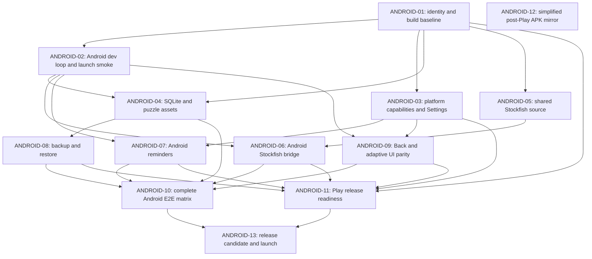

# Android Local-First Release Plan

Status date: 2026-07-13
Status: approved design; implementation in progress

The goal is to ship Chessticize Mobile on Android from the existing monorepo,
with the same offline practice product as iOS and without introducing a second
frontend or a cross-platform account system.

The approved product specification is
[GitHub issue #171](https://github.com/Chessticize/chessticize-mobile/issues/171).
Implementation is tracked by its native sub-issues
[#172 through #188](https://github.com/Chessticize/chessticize-mobile/issues/171).
The numbered work packages below describe architectural and release
capabilities; the implementation issues regroup that work into independently
verifiable tracer-bullet slices, so the two lists are not one-to-one. GitHub's
issue dependency graph and live issue state are authoritative for execution.

At the status date, the Mobile Platform Capabilities foundation in
[#172](https://github.com/Chessticize/chessticize-mobile/issues/172) and the
shared Stockfish source migration in
[#175](https://github.com/Chessticize/chessticize-mobile/issues/175) have been
completed and merged.

## Release scope

The Android Local-First Release includes:

- Standard, Custom, and Arrow Duel practice;
- Review, History, ratings, settings, and local progress persistence;
- the bundled puzzle pack and on-device Stockfish analysis;
- local review reminders;
- Android-managed backup and device-to-device restore for user progress;
- phones and tablets in portrait and landscape;
- basic foldable and ChromeOS compatibility;
- Google Play binary distribution with matching corresponding source on GitHub.

It excludes:

- iOS-to-Android or Android-to-iOS progress synchronization;
- Chessticize accounts or a Chessticize-operated backend;
- Android TV, Wear OS, Automotive, and XR experiences;
- 32-bit ABIs;
- analytics, crash-reporting, tracking, and remote telemetry SDKs;
- exact alarms, push notifications, and background update checks;
- a separate Android Material redesign or duplicated Android screen tree.

The accepted decisions are recorded in:

- [ADR 0001: local-first Android release](./adr/0001-android-first-release-is-local-first.md)
- [ADR 0002: OS-managed Android progress backup](./adr/0002-use-os-managed-android-progress-backup.md)
- [ADR 0003: one shared Stockfish source](./adr/0003-share-one-stockfish-source-across-mobile-platforms.md)
- [ADR 0004: one product-aware Back contract](./adr/0004-use-one-product-aware-mobile-back-contract.md)
- [ADR 0005: shared product UI](./adr/0005-share-the-product-ui-across-mobile-platforms.md)
- [ADR 0006: zero app telemetry](./adr/0006-keep-mobile-releases-free-of-app-telemetry.md)
- [ADR 0009: post-Play APK mirror](./adr/0009-mirror-play-signed-android-apk-after-play-release.md)

## Repository and reuse model

Android belongs in this repository. The target layout is:

```text
packages/core/                 shared business rules
packages/storage/              shared persistence and merge contracts
apps/mobile/src/               shared React Native UI and mobile backend shell
apps/mobile/native/stockfish/  shared Stockfish source and license artifacts
apps/mobile/ios/               thin iOS native adapters and build project
apps/mobile/android/           thin Android native adapters and Gradle project
```

The maintenance split is:

| Area | Reuse expectation | Additional Android maintenance |
| --- | --- | --- |
| Sprint, ELO, review, puzzle selection, history, Arrow Duel | Reuse directly from `packages/core` | None beyond shared behavior tests |
| SQLite schema and repository behavior | Reuse contracts and behavior from `packages/storage` | Android device adapter, asset location, backup rules, restore evidence |
| Progress sync merge | Reuse as dormant shared capability | No Android transport in this release; CloudKit remains iOS-only |
| React Native screens and chessboard interaction | Reuse one screen/component tree | System surfaces, font/inset/touch differences, Back integration, Android screenshot baselines |
| Stockfish orchestration and JavaScript contract | Reuse directly | Kotlin/JNI/CMake bridge and Android lifecycle handling |
| Review-reminder policy | Reuse `computeNextReminder` and scheduler contract | AlarmManager, notification permission/channel, receivers, routing |
| Tests | Reuse unit, integration, component, and journey intent | Android build/device configurations and platform-specific system assertions |
| Distribution | Share product version and release evidence | Play signing/AAB plus source-first GitHub Release and post-Play APK mirror |

Platform checks must stay at adapter or presentation boundaries. Shared domain
code must not import React Native or branch on `Platform.OS` to make product
decisions.

## Delivery dependency graph



After ANDROID-01, the dev-loop, capability, storage, and shared-Stockfish work
can proceed in parallel. The release candidate remains blocked until every
native capability and the complete Android evidence matrix converge on one
exact commit.

## Work packages

### ANDROID-01 — Establish the Android identity and build baseline

**Outcome:** The existing Android scaffold becomes an honest, reproducible
64-bit Chessticize build without claiming release readiness.

**Work:**

- Change Gradle `namespace`, `applicationId`, and Kotlin package paths from
  `com.chessticizemobile` to `com.chessticize.mobile`.
- Keep `minSdk` 24, set `compileSdk` and `targetSdk` to 36, and restrict native
  builds to `arm64-v8a` and `x86_64`.
- Centralize the shared public version name while keeping Android `versionCode`
  independent from the iOS build number.
- Remove debug signing from the release build. Make release signing fail closed
  when the upload-key configuration is absent; no keystore or password enters
  the repository.
- Produce debug APK and release AAB tasks and add a path-scoped Android compile
  check. Do not publish an artifact from this work package.
- Audit every bundled native dependency for 16 KB page-size compatibility. This
  includes React Native, Hermes, Skia, OP-SQLite, and later Stockfish output.

**Acceptance:**

- Android installs and launches with application ID `com.chessticize.mobile`.
- Package declarations, generated configuration, and manifest identity agree.
- Only the two approved ABIs appear in built artifacts.
- A release build cannot silently fall back to the debug key.
- A 16 KB alignment check exists and fails on any incompatible release `.so`.

**Validation:** Gradle identity tests, debug assemble, unsigned or
secret-injected release bundle build, artifact inspection, and Android lint.
This is full native validation because it changes global Android build and app
identity configuration.

### ANDROID-02 — Add the Android development loop and launch smoke

**Depends on:** ANDROID-01

**Outcome:** Contributors and CI can build, launch, and collect exact-head
Android evidence before feature-specific native work begins.

**Work:**

- Add an Android environment doctor covering JDK, Android SDK, NDK, CMake,
  emulator, ADB, accepted licenses, and required API 24/API 36 system images.
- Add Android Detox app, device, and configuration entries without disturbing
  the iOS configurations.
- Add planned commands such as `mobile:doctor:android`,
  `mobile:e2e:build:android`, and `mobile:e2e:test:android`.
- Create a dedicated API 36 `x86_64` Detox emulator and a minimal public-UI
  launch smoke.
- Extend the repo development-loop documentation and local-E2E skill with
  Android routing, evidence fields, and clean-worktree rules.
- Keep Detox fixtures on the public storage path; do not introduce test-only
  calls into repositories or native modules.

**Acceptance:** A fresh documented machine or worktree can doctor, build,
launch, run the smoke, and record the exact commit. iOS Detox still resolves
its existing configurations unchanged.

**Validation:** Process-contract validation, Android build, one Detox launch
smoke, and an iOS Detox configuration resolution check.

### ANDROID-03 — Introduce platform capabilities and truthful Settings

**Depends on:** ANDROID-01

**Outcome:** Shared UI consumes typed platform capabilities instead of treating
iCloud as the generic mobile sync model.

**Work:**

- Introduce a narrow injected platform-capability boundary for progress
  protection, review reminders, app metadata, and external release links.
- Preserve the existing CloudKit transport and iCloud controls on iOS.
- Remove generic state and names that assume `iCloudEnabled` is meaningful on
  every platform.
- On Android, hide iCloud controls and show a read-only “Backup & Device
  Transfer — Managed by Android” surface with a system-settings link when the
  platform exposes one.
- Replace the hard-coded App Version value with native version name and build
  metadata.
- Add an Android-only “Open Source Releases” action. It opens the browser only
  after a user gesture and never polls GitHub in the background.

**Acceptance:** iOS Settings behavior is unchanged; Android contains no iCloud
copy or nonfunctional sync control; all visible platform claims reflect a real
capability; version and build values come from the installed artifact.

**Validation:** Platform-parameterized component behavior tests, mobile
typecheck, iOS sync regression tests, and Android link/metadata adapter tests.
No Detox is required unless native metadata or settings routing cannot be
proven below that layer.

### ANDROID-04 — Prove Android SQLite persistence and bundled puzzle access

**Depends on:** ANDROID-01 and ANDROID-02

**Outcome:** The real Android app uses the existing storage contracts, retains
progress across relaunch, and reads the same bundled puzzle pack as iOS.

**Work:**

- Adapt `deviceSQLiteStore` asset and database locations without changing
  shared repository behavior.
- Use OP-SQLite as the real writable progress database and keep the bundled
  puzzle database read-only and separate.
- Run the existing real-SQLite behavior and migration suites against the
  Android-relevant schema contract.
- Verify ratings, attempts, sprint sessions, review queue, and settings survive
  process death and app relaunch.
- Verify release assets contain the intended Core Pack exactly once and that
  test fixtures do not replace production assets.
- Record baseline APK/AAB size contributions for the puzzle pack, NNUE assets,
  native libraries, and JavaScript bundle.

**Acceptance:** Android has no MemoryStore fallback in release, persistence
survives relaunch, migrations preserve existing progress, and puzzle selection
uses the shipped pack through the public app path.

**Validation:** Unit and storage integration suites, component wiring tests,
mobile typecheck, Android persistence Detox, and artifact inspection. The
adapter wiring requires targeted Android native validation.

### ANDROID-05 — Move Stockfish into a shared native source module

**Depends on:** ANDROID-01

**Outcome:** One Stockfish C++ source and license tree serves both platforms
while iOS behavior remains unchanged.

**Work:**

- Move Stockfish source, required NNUE networks, version metadata, notices, and
  GPL artifacts out of the iOS-owned tree into `apps/mobile/native/stockfish`.
- Update Xcode references and source-attribution links without changing the
  existing Objective-C++ JavaScript contract.
- Make source version, engine-reported version, NNUE identity, and license tests
  derive from the shared module.
- Prove UCI handshake, fixed-position analysis, MultiPV ordering, cancellation,
  teardown, and background behavior remain unchanged on iOS.

**Acceptance:** There is one engine source tree, no duplicated platform copy,
all release notices still ship, and the current iOS engine behavior is
byte-for-byte or behaviorally equivalent where paths necessarily change.

**Validation:** Native engine tests, source/license regression tests, mobile
typecheck, iOS build, and exact-head full iOS `flows` plus `practice`. Moving a
large native source boundary has broad iOS blast radius.

### ANDROID-06 — Implement the Android Stockfish bridge

**Depends on:** ANDROID-02 and ANDROID-05

**Outcome:** Android implements the existing `NativeStockfishEngine`
JavaScript contract with the shared engine source.

**Work:**

- Add a thin Kotlin/JNI/CMake bridge with no chess or analysis policy in Kotlin.
- Compile Stockfish for `arm64-v8a` and `x86_64` only, with release optimization,
  symbol handling, and 16 KB ELF alignment.
- Package the shared NNUE assets once, not once per ABI.
- Implement deterministic start, command, line-event, cancellation, teardown,
  activity/background, and error behavior matching the existing transport.
- Prevent engine work or native callbacks from blocking the React Native UI
  thread or surviving a destroyed bridge.
- Record fixed-position parity and practical analysis latency on the API 36
  emulator and a physical ARM64 phone; investigate material platform drift
  rather than encoding an arbitrary benchmark target.

**Acceptance:** The shared native-engine behavior suite passes on iOS and
Android; Analysis and Review use the real engine; cancellation and repeated
open/close cycles leak neither workers nor callbacks; the 16 KB release image
launches without compatibility mode.

**Validation:** Native unit/integration tests, Android fixed-position and
cancellation tests, targeted `practice` Detox, one physical-device engine
smoke, release artifact ABI/alignment inspection, and an iOS regression build.

### ANDROID-07 — Implement Android review reminders

**Depends on:** ANDROID-02 and ANDROID-03

**Outcome:** Android delivers local review reminders with honest inexact timing
and routes users into Review.

**Work:**

- Implement the existing reminder scheduler and notification-client contracts
  using AlarmManager and Android notifications.
- Use one-shot inexact alarms; request no exact-alarm permission.
- Create the notification channel and request `POST_NOTIFICATIONS` on Android
  13 and later only after the existing product prompt.
- Persist enough schedule intent to reconstruct the next reminder after reboot,
  app update, timezone change, time change, or locale change.
- Route cold-start and foreground notification taps through the existing Review
  route contract.
- Expose Android notification settings through the platform capability without
  changing iOS notification behavior.

**Acceptance:** Reminder policy remains shared and deterministic; Android copy
does not promise exact-minute delivery; denied permission is recoverable;
reboot/timezone rescheduling does not duplicate notifications; tapping a
notification opens the intended Review surface.

**Validation:** Core reminder tests, fake scheduler/client behavior tests,
Android native fixture tests, targeted `flows` Detox for routing, and a physical
device scheduling/permission smoke. Doze delay is recorded as expected platform
behavior, not a failure of exact delivery.

### ANDROID-08 — Enable restricted Android backup and device transfer

**Depends on:** ANDROID-04

**Outcome:** Android can restore user progress after reinstall or device
transfer without becoming a synchronization service.

**Work:**

- Replace `allowBackup=false` with explicit API-appropriate backup rules for
  Android 7 through Android 16.
- Include only the user progress database and required sidecar files.
- Exclude the puzzle pack, NNUE files, caches, logs, temporary files, test
  fixtures, and generated artifacts.
- Require available encryption capabilities for cloud backup and retain
  device-to-device transfer behavior.
- Do not enable Android cross-platform transfer.
- Keep the backed-up progress set below Android Auto Backup's 25 MB per-user
  quota and add a release check that reports actual database size.
- Test restoration into the current schema and through every released
  migration fixture; a restore failure must preserve the original data.
- Update the privacy policy and Play Data Safety explanation without describing
  OS-managed backup as Chessticize collection or continuous sync.

**Acceptance:** A fresh install restores ratings, history, review queue,
sessions, and settings; bundled assets come from the installed app rather than
backup; encrypted-cloud requirements are represented in the platform rules;
restored older schemas migrate without data loss.

**Validation:** Backup-rule tests, manifest inspection, real backup/restore and
device-transfer evidence, released-fixture migration matrix, database quota
measurement, and a native upgrade smoke.

### ANDROID-09 — Integrate product-aware Back and adaptive UI parity

**Depends on:** ANDROID-02 and ANDROID-03

**Outcome:** Android behaves like the same product while respecting Android
system navigation and presentation boundaries.

**Work:**

- Represent Back as one testable frontend intent rather than duplicating
  product state decisions in Kotlin.
- Dismiss transient UI first; use guarded pause or exit behavior for active
  Practice and Review sessions; return child flows to parents; return top-level
  Review, History, and Settings to Practice; delegate back-to-home only from an
  idle Practice home.
- Integrate supported Android system Back and Predictive Back APIs without
  intercepting obsolete key events or adding a permanent Android-only button.
- Validate status/navigation bars, safe areas, keyboard resize, font metrics,
  touch feedback, accessibility, and portrait/landscape geometry.
- Keep one shared screen tree and separate platform screenshot baselines.
- Treat foldable and ChromeOS checks as basic compatibility: no crash, clipped
  critical control, unusable board, or broken rotation state.

**Acceptance:** Every Back state has deterministic public behavior; a session
cannot be silently discarded; predictive back-to-home works from the root;
phone and tablet layouts preserve critical controls and board interaction; iOS
screens and navigation remain unchanged.

**Validation:** Back-state unit/component tests, accessibility behavior tests,
targeted Android `flows` and `practice` journeys, and API 36 phone/tablet/foldable
screenshot inspection.

### ANDROID-10 — Complete the Android E2E and release-validation matrix

**Status:** Automated in `Mobile Android` and documented in
`docs/ANDROID_VALIDATION.md`. Physical ARM64 execution remains owner-recorded
release evidence at #200 and #188.

**Depends on:** ANDROID-04, ANDROID-06, ANDROID-07, ANDROID-08, and ANDROID-09

**Outcome:** Android has auditable native evidence at PR, nightly, and release
gates without duplicating product-journey intent.

**Work:**

- Reuse the existing `flows` and `practice` journey intent, with platform
  branches only where system surfaces genuinely differ.
- Keep the current PR risk scopes: no native validation, targeted native
  validation, and full native validation.
- Add API 36 `x86_64` phone nightly execution of complete `flows` and `practice`
  suites after one build.
- Add an API 24 phone smoke for launch, practice, persistence, migration, and a
  bounded packaged native-engine check.
- Add API 36 tablet and foldable adaptive-layout smoke and screenshots.
- Require a physical ARM64 phone smoke for Stockfish, notifications, backup,
  and upgrade installation before release.
- Record commit SHA, build result, commands, scope, results, artifact links, and
  clean-worktree confirmation. Any later code change invalidates native
  evidence.
- Update `docs/TESTING_ARCHITECTURE.md`, the development-loop skill, and release
  checklists only when the corresponding commands actually exist.

**Acceptance:** Routine shared changes retain cheap validation; Android native
changes select the smallest proving scope; nightly main runs both complete
suites; the release matrix can be reproduced from documentation on a clean
worktree.

**Validation:** Exercise the local evidence script itself, run the complete API
36 matrix once on exact head, run the API 24/adaptive smokes, and validate the
process contract.

### ANDROID-11 — Complete Google Play release readiness

**Status:** Repository-owned versioning, installed-artifact metadata, signed-AAB
verification, symbols/notices, listing declarations, and fail-closed owner
evidence are implemented by #186. Production upload signing, Play App Signing,
developer verification, Internal/Closed installation, pre-launch review, and
Production-draft evidence remain owner-executed and cannot be inferred from the
repository.

**Depends on:** ANDROID-01, ANDROID-03, ANDROID-06, ANDROID-07, ANDROID-08, and
ANDROID-09

**Outcome:** One validated AAB can pass Play review and move through Internal,
Closed, and Production tracks.

**Work:**

- Enroll `com.chessticize.mobile` in Play App Signing and Android developer
  verification; record the production signing-certificate SHA-256 fingerprint.
- Provision a least-privilege upload/service identity in protected secrets.
- Finalize release signing, R8/ProGuard decisions, native debug symbols,
  mapping artifacts, version code policy, and reproducible AAB generation.
- Verify API 36 targeting, 64-bit-only support, 16 KB page-size compatibility,
  permissions, exported components, backup rules, and no debug/test surfaces.
- Prepare icons, adaptive icon, splash, phone/tablet screenshots, English store
  listing, free pricing, Games category, content rating, support URL, privacy
  URL, Data Safety, open-source notices, and developer-verification state.
- Upload one build to Internal Testing, promote the same build through Closed
  Testing, inspect Pre-launch Report and Android Vitals, then prepare Production
  for a direct 100 percent release.
- Add a release check that inventories network clients and SDKs to preserve
  Zero App Telemetry.

**Acceptance:** Play Console shows no blocking errors; the tested AAB is the
same version code selected for Production; signing and developer verification
are complete; store claims match real behavior; release artifacts contain no
debug key or test controls.

**Validation:** Signed AAB inspection, Play Internal and Closed installation,
Pre-launch Report triage, Data Safety/privacy review, license/source checks,
16 KB native-library verification, and the release privacy regression suite.

### ANDROID-12 — Simplified post-Play APK mirror

**Status:** Reframed by ADR-0009. Google Play remains the primary binary
channel. After the owner publishes and smoke-tests the Play build, one manual
CI job downloads the Play-generated universal APK and attaches it with a
SHA-256 checksum to the already-public corresponding-source Release. The job
does not rebuild, rerun product tests, consume owner evidence, or use separate
prepare/publish phases. A temporary GitHub token and additional publication
environments are not release dependencies. Build 5 is the current candidate;
the published build-1/build-4 releases and failed-validation build-2/build-3 records remain
immutable historical evidence.

### ANDROID-13 — Validate the release candidate and launch

**Depends on:** ANDROID-11 plus the validation scope selected from ANDROID-10

- Current release tag: `android-v1.2.0-build-5`

**Outcome:** One exact commit is distributed through Play with its matching
source published on GitHub and proportionate evidence.

**Work:**

- Freeze the release-candidate commit and confirm a clean worktree and matching
  shared public version.
- Run exact-head fast checks and the delta, targeted, or broad native scope for
  the changed boundary. Full Detox, API 24, and adaptive jobs are not automatic
  delta gates.
- Run the owner physical-device smoke every time; add Stockfish, notification,
  backup/restore, migration, and upgrade checks only when those boundaries
  changed.
- Complete Internal/Closed, pre-launch, listing, privacy, and account checks for
  first launch or when Play requires or the corresponding configuration changes.
- Promote the validated AAB to Production at 100 percent.
- Confirm the signed-candidate workflow published the matching source Release
  using the built-in token. After Play publication and device smoke, dispatch
  the single post-Play APK mirror job.
- Record the final Play version code, GitHub source Release URL, AAB checksum,
  exact commit SHA, selected validation scope, and owner device-smoke result.

**Acceptance:** All risk-scoped gates are green on the exact released commit;
Play distributes the signed Android build, GitHub publishes its corresponding
source, the owner device smoke passes, and no known relevant blocker remains.

This work package is a release operation and evidence issue, not a feature PR.

## Release validation matrix

| Gate | Required Android evidence |
| --- | --- |
| Routine PR | Relevant fast tests; no Android Detox for documentation, pure domain/storage/CLI work, or ordinary UI behavior already proven by component tests |
| Targeted native PR | Affected Android spec or one affected suite on the exact PR head |
| Broad native PR | One build plus complete Android `flows` and `practice` on the exact PR head |
| Nightly `main` | API 36 `x86_64` phone, complete `flows` and `practice` |
| Delta release candidate | Exact-head fast checks, production-signed AAB/source publication job, and owner physical-device smoke |
| Targeted release candidate | Delta gates plus the affected Android suite or native/manual boundary |
| Broad native or first launch | API 36 complete suites; relevant API 24/adaptive/backup checks; full physical ARM64 checklist; applicable Play console evidence |

SQLite schema changes still require the released-fixture migration matrix and a
native upgrade smoke. Android backup rule changes require a real restore. Native
library changes require ABI, 16 KB, symbol, and physical-device checks.

## Early risk checks

The following checks should happen before the dependent work grows:

1. **Native compatibility:** Every direct and transitive `.so` must support 16
   KB pages. Google Play has required this for API 35+ submissions since
   2025-11-01. NDK 27 is already configured, but prebuilt libraries still need
   artifact-level verification.
2. **Artifact size:** The current puzzle database is about 490 MB raw and the
   two NNUE networks are about 107 MB raw. Local compression measurements imply
   a direct universal APK in roughly the 330–365 MB range, but the first real
   Android release builds must replace this estimate.
3. **Backup quota:** Auto Backup allows 25 MB per user. Only the progress
   database may enter backup, and its actual size and growth must be measured.
4. **Cross-channel signing:** Play and GitHub installs can update each other only
   when application ID, signing certificate, and monotonically increasing
   version code agree.
5. **Generated universal APK:** The Play API exposes a universal APK only when
   Play generated one for the bundle. The post-Play mirror fails safely and can
   be retried if this file is not yet available.
6. **Developer verification:** The package and signing identity must be
   registered before regional enforcement and the planned global expansion of
   Android developer verification affect sideload installation.
7. **No hidden iOS regression:** Source relocation and platform-capability work
   must preserve CloudKit, iOS notifications, Stockfish, and current iOS release
   evidence throughout the Android program.

## Definition of Android release readiness

The Android Local-First Release is ready only when:

- every included iOS product behavior has a working Android public-UI path;
- shared business logic remains outside React Native screens and native code;
- the real SQLite and Stockfish implementations pass their shared behavior
  contracts;
- notification, backup, Back, adaptive-layout, migration, and upgrade failure
  paths are proven;
- all Android native libraries pass 64-bit and 16 KB checks;
- the exact release commit passes the accepted Android validation matrix;
- Play listing, privacy, Data Safety, developer verification, signing, and
  release evidence are complete;
- Production is released directly to 100 percent;
- the matching corresponding-source manifest is public before distribution and
  the exact Play-signed APK plus checksum is mirrored after owner acceptance;
- the app contains no cross-platform sync promise, background updater, or app
  telemetry pipeline.

## Reference constraints

- [Android application ID and module configuration](https://developer.android.com/build/configure-app-module)
- [Google Play target API requirements](https://developer.android.com/google/play/requirements/target-sdk)
- [16 KB page-size support](https://developer.android.com/guide/practices/page-sizes)
- [Android Auto Backup](https://developer.android.com/identity/data/autobackup)
- [Android alarm guidance](https://developer.android.com/develop/background-work/services/alarms)
- [Predictive Back](https://developer.android.com/guide/navigation/custom-back/predictive-back-gesture)
- [Android developer verification](https://developer.android.com/developer-verification/guides)
