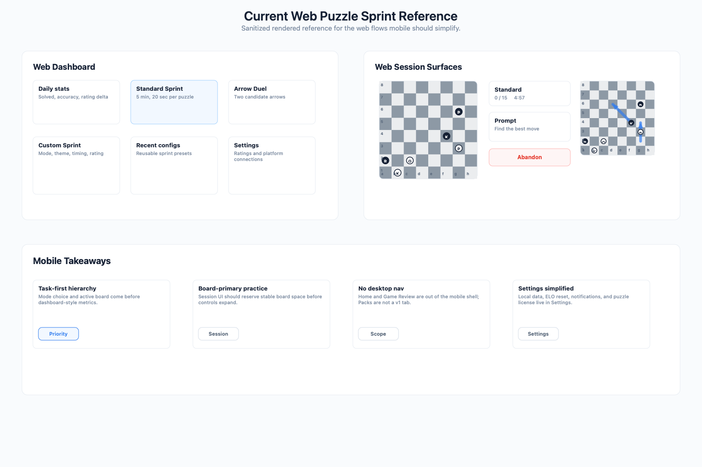

# Mobile UI Design

This document captures the current Chessticize web Puzzle Sprint experience, the current Chessticize Mobile implementation shape, and the remaining mobile-first UI requirements. Game Review is intentionally out of scope for the mobile app.

## Current Web Observations

The current web app was reviewed in Chrome on `chessticize.com`, focused on Puzzle Sprint flows. Raw screenshots were captured during review, but public repository artifacts use a sanitized schematic so usernames, exact ELO values, personal stats, and dates are not published.

### Sanitized Capture Summary

### Functional Inventory

- Main navigation includes Home, Puzzle Sprint, Game Review, and Settings. Mobile should exclude Game Review from the app scope.
- Puzzle Sprint dashboard shows daily stats, Standard Sprint, Arrow Duel, Blitz Sprint, recent custom sprint configs, and a Custom Sprint entry.
- Standard Sprint session shows Abandon, success progress, timer, turn prompt, and a large chessboard.
- Arrow Duel session shows Abandon, success progress, timer, a short instruction card, a chessboard, and two candidate arrows.
- Custom Sprint setup includes mode, theme, duration, time per puzzle, computed puzzle count, ELO type, and previous custom configs.
- Settings includes chess platform connections and ELO editing. Mobile v1 should keep ELO reset/rating management but not prioritize chess.com or Lichess account import.

### Current UI Issues To Avoid

- Desktop navigation and wide centered cards do not translate cleanly to mobile practice.
- The tan/brown board dominates the screen and makes the product feel warmer and heavier than desired.
- Arrow Duel uses decorative emoji in instructional text; mobile should avoid emoji and rely on concise labels and state colors.
- The web dashboard mixes summary stats, mode selection, and recent configs in one broad page. Mobile needs a tighter task-first hierarchy.
- Settings exposes many ELO fields as editable inputs. Mobile should prefer explicit reset/adjust flows and avoid a dense form by default.

## Complete App Design Board

The design board below is a simulator-captured implementation snapshot from the current iOS app. It is useful for reviewing the actual product shape, but the written specifications in this document are authoritative for exact copy, scoring behavior, chart placement, licensing text, and remaining implementation details. The captured build is a development/test build, so it may show QA-only controls such as the puzzle source switch and review notification test actions that must remain hidden in release builds.

All visual design artifacts in this document use PNG renderings. The full design board is captured from the simulator; the other rendered boards are implementation-target mockups that use the same color, spacing, board, control, and device-frame language.

The board covers these current major screens:

- Practice Home
- Standard Sprint Active
- Arrow Duel Active
- Sprint Results
- Review Queue
- Analysis Review
- History
- Custom Sprint Setup
- Settings
- Puzzle Data / License

Screen inventory:

| Screen | Main layout | Primary actions | Navigates to |
| --- | --- | --- | --- |
| Practice Home | Mode list, progress summary, due review strip, bottom tabs | Start Standard, Arrow Duel, Blitz, Custom; resume interrupted session | Active Sprint, Custom Sprint, Review Queue |
| Standard Sprint Active | Focused session shell, status bar, board, prompt | Make board move, abandon, complete/fail sprint | Sprint Results |
| Arrow Duel Active | Focused shell, status bar, board, neutral candidate arrows | Choose a candidate on the board, abandon, complete/fail sprint | Sprint Results, Analysis Review |
| Sprint Results | Win/loss status, solved count, rating change, mistakes, actions | Review mistakes, play again, done | Review Item, Practice Home |
| Review Queue | Due/overdue summary, difficulty groups, start button | Start due review, filter queue | Review Item |
| Analysis Review | Board, compact toolbar, Stockfish status, candidate line rows, guided arrows when applicable | Reset, flip, analyze, navigate, finish review | Review Complete, History |
| History | Rating trend line chart, range filters, selected ELO bucket, expandable row filters, attempt rows | Filter wrong-only/source rows, inspect attempt context, open attempt | Attempt Detail, Review Item |
| Custom Sprint Setup | Mode/theme/timing controls, estimate, rating range, start | Start sprint, save template | Active Sprint |
| Settings | Local data, reset, export, notifications, about, puzzle-data source notes | Export data, delete local history, reset ELO, inspect licenses | Confirm Sheet, Puzzle Data / License |
| Puzzle Data / License | Bundled source name, puzzle count, source license, Lichess-derived attribution, presolve metadata | Inspect source and license notes | Settings |

## Mobile Information Architecture

Use a four-tab app shell:

- Practice: quick start, active session, custom sprint setup, and Arrow Duel entry.
- Review: due mistake reviews and spaced repetition queue.
- History: attempts, sprint sessions, range filters, selected ELO bucket, and expandable detailed filters including wrong-only/source filters.
- Settings: local data, ELO reset, export/delete data, notification preferences, advanced rating adjustment, and puzzle data attribution.

There should be no mobile Home tab, Game Review tab, or Packs tab in v1.

Navigation rules:

- Practice is the default launch tab.
- Active practice sessions hide the tab bar and use a focused session shell.
- Review and History both open the same board-based review surface, but with different entry context.
- The app has two review concepts. Analysis Review is an unscored replay/analyze surface. Scheduled Review is the official spaced repetition flow that records review attempts and updates the queue.
- Settings is the only place for data-destructive actions such as ELO reset and history delete.
- Settings owns puzzle data source attribution and license notes for the bundled offline puzzle data.
- The app does not expose pack import, removal, or switching controls in v1.

Primary flows:

| Flow | Steps | Notes |
| --- | --- | --- |
| Standard or Blitz practice | Practice Home -> Standard Sprint Active -> Sprint Results -> Practice Home | Board moves submit answers directly. Win by solving the target count before time/mistake failure. |
| Arrow Duel practice | Practice Home -> Arrow Duel Active -> Sprint Results -> Analysis Review | Candidate arrows are neutral until selection. Win by solving the target count before time/mistake failure. |
| Custom sprint | Practice Home -> Custom Sprint Setup -> Standard Sprint Active or Arrow Duel Active -> Sprint Results | The selected mode determines the active session shell. |
| Due mistake review | Review Queue -> Scheduled Review Item -> Review Complete -> Review Queue | Correct answers increase interval; failures reset or shorten it. Official review attempts are recorded in History. |
| Post-session analysis | Sprint Results or Scheduled Review Complete -> Analysis Review -> Results or Practice | Used to inspect mistakes immediately. It is opened only by the result-screen review action, does not write History, and does not change the spaced repetition schedule. |
| History replay | History -> Filtered row -> Analysis Review | History preserves original attempt context. Previous/next navigation stays inside the active History filter. |
| Local data | Settings -> Confirm Sheet -> Settings | Progress stays on device; export and delete actions are explicit. |

## Design Principles

- Board first: during practice and review, the board is the primary surface and must receive the largest stable area.
- Local-first clarity: in v1, the user should see that progress is stored on device only. Do not imply cloud sync until a real sync engine ships.
- Calm density: show enough data for repeated training, but avoid desktop dashboards, marketing hero panels, or decorative statistics.
- One-handed portrait first: primary controls should sit below or immediately above the board and remain reachable.
- Adaptive by slot, not by device name: layouts should derive from available width, available height, safe-area insets, and size class rather than from a hard-coded iPhone or iPad model.
- Business state comes from the local backend/domain core. UI screens render view models and dispatch typed intents.
- No hidden scoring changes: UI controls such as hint, skip, undo, or analysis must not appear in scored sprint mode unless the scoring rules explicitly support them.

## Adaptive Layout And Orientation

The current implementation and App Store target are still portrait-only, but the design target should support compact portrait, compact landscape, and regular-width iPad layouts. Unlocking the orientation mask should happen only after the adaptive shell, component tests, simulator screenshots, and App Store screenshot coverage are in place.

Adaptive classes:

| Class | Typical viewport | Navigation | Content rule |
| --- | --- | --- | --- |
| Compact portrait | iPhone portrait, narrow split view | Bottom tab bar when app chrome is visible | Existing one-column scroll. Active sessions hide tabs and stack status, board, score, prompt, and results vertically. |
| Compact landscape | iPhone landscape, short height | Icon rail outside active sessions; no bottom tab bar while playing | Active session uses a board lane plus a right control rail. The control rail owns status, prompt, score, pause/abandon, and overflow scrolling. |
| Regular width | iPad portrait/landscape, large split view | Persistent side rail with labels when width allows, icon-only rail below that | Use two-pane or three-pane layouts with constrained content width. Board/review surfaces stay centered and support panels sit beside the board. |

Sizing rules:

- Derive layout from `useWindowDimensions()` width and height plus safe-area insets. Width-only board sizing is not enough for landscape because height becomes the limiting axis.
- Board size is computed from the board slot, not from screen width. Use `min(slotWidth, slotHeight)` with a stable minimum and maximum per class.
- Phone portrait board target: fill the content width up to the existing max, while keeping prompt and score visible below the board.
- Phone landscape board target: maximize board height after subtracting top status chrome, bottom/home-indicator inset, and vertical gaps. Cap the board at the phone class maximum and let only the control rail scroll.
- iPad board target: cap at a comfortable inspection size rather than filling the whole display. A 560-640 pt board is usually enough; extra space belongs to analysis, queue, history, or settings detail panels.
- Never scale type with viewport width. Keep platform text sizes stable and let columns, gaps, and panel counts change instead.

Navigation rules:

- Bottom tabs are for compact portrait only.
- Compact landscape uses a narrow vertical rail outside active sessions so navigation does not consume scarce height.
- Regular width uses a persistent side rail. At wider iPad sizes, show icon plus text labels; at narrower split-view widths, collapse to icon-only.
- Active practice and review sessions hide global navigation in every class. The exit/close affordance remains in the session header or control rail.

Safe-area rules:

- No board, tab, rail, or primary control may sit under the Dynamic Island, camera cutout, rounded-corner exclusion, or home indicator.
- In compact landscape, prefer left or right rails that can absorb notch/camera safe area without compressing the board.
- Keep 44 x 44 pt minimum hit targets after safe-area padding is applied.
- Panels that overflow in landscape should scroll internally; the board itself must not be pushed off-screen by long prompt, engine, or review text.

### Adaptive Practice And Review

Practice Home:

- Compact portrait keeps the current task-first list.
- Compact landscape shows a left navigation rail plus a two-column content area: mode shortcuts and progress/review summary. Avoid a wide desktop dashboard.
- Regular width uses two columns: primary practice modes on the left, progress/review/resume cards on the right. Keep the active "Start" affordance close to the mode row.

Active Sprint:

- Compact portrait keeps the current vertical stack.
- Compact landscape uses board lane plus control rail. The board lane contains the board and any board-adjacent status. The control rail contains timer, progress, mistakes, side-to-move, prompt, pause, and abandon confirmation.
- The prompt must not appear below the fold in landscape. If the prompt plus actions overflow, the control rail scrolls independently while the board remains fixed.
- Arrow Duel candidate arrows stay on the board in every class. Do not move candidate selection into separate landscape buttons.

Analysis Review:

- Compact portrait keeps board above the analysis toolbar and line list.
- Compact landscape puts the board in the larger lane and the analysis/guided-line panel in the control rail.
- Regular width uses board plus inspector. The inspector can hold analysis controls, engine status, candidate rows, and the Continue action without covering the board.
- History-launched review should preserve previous/next navigation in the header or inspector, not in a bottom toolbar.

History:

- Compact portrait keeps range chips, selected ELO bucket, trend, and attempt rows stacked.
- Compact landscape and regular width can use a split view: filters and chart on one side, attempt list/detail on the other.
- Regular-width attempt detail may open beside the list rather than replacing the full screen, but Analysis Review still owns the full board surface when launched.

Settings:

- Compact portrait keeps the current stacked settings groups.
- Compact landscape and iPad regular width can use a master/detail settings layout: groups on the left, selected group detail on the right.
- Destructive confirmations remain modal or sheet-based and must not become small inline controls in wide layouts.

Implementation notes:

- Introduce a small adaptive layout model, for example `compactPortrait`, `compactLandscape`, `regularPortrait`, and `regularLandscape`, derived from measured width, height, and safe-area insets.
- Replace the current width-only board sizing with a reusable board-slot calculation shared by active sprint and review.
- Keep view models and domain behavior unchanged; adaptive layout should only change rendering, navigation placement, and panel composition.
- Update iOS orientation/device-target configuration only after the adaptive UI is covered by component tests and simulator screenshots.

## Visual Direction

The mobile UI should feel like a quiet training tool, not a marketing page.

Color tokens:

- App background: `#F8FAFC`
- Surface: `#FFFFFF`
- Primary text: `#111827`
- Secondary text: `#64748B`
- Border: `#E2E8F0`
- Accent: `#2563EB`
- Board light square: `#E6E8EB`
- Board dark square: `#7B8794`
- Correct: `#16A34A`
- Wrong: `#DC2626`
- Warning: `#D97706`
- Highlight: `#FACC15`

Style rules:

- No gradients, decorative blobs, or emoji.
- Use cards only for repeated list items, modals, and framed tools.
- Avoid nested cards.
- Keep controls stable in height and width to prevent layout shift during timers and progress changes.
- Use icons only where they reduce text, with accessible labels.
- Board and timer areas should be optimized for one-handed portrait use.

Typography:

- Use the platform system font.
- Screen title: 22-24 pt, semibold.
- Section title: 16-18 pt, semibold.
- Body text: 15-16 pt.
- Metadata and helper text: 12-13 pt.
- Timer text: tabular numerals, 18-22 pt depending on surface.

Spacing and shape:

- Base spacing unit: 4 px.
- Screen horizontal padding: 16 px on phones.
- Component gap: 8, 12, or 16 px.
- Cards and sheets: 8 px radius unless native platform controls require otherwise.
- Board radius: 6-8 px, never a floating decorative card inside another card.
- Hit target minimum: 44 x 44 px.

Core components:

- `SessionStatusBar`: mode, ELO, progress, timer, mistakes, pause/abandon affordance.
- `ChessboardSurface`: reused board component plus highlight/arrow overlay adapter.
- `ModePicker`: compact list or segmented choice for Standard, Arrow Duel, Blitz, Custom.
- `ReviewQueueHeader`: due count, overdue count, and next review estimate.
- `HistoryFilterBar`: date-range chips, selected ELO bucket, compact filter toggle, and expandable result/source filters.
- `RatingTrendChart`: rating-only line chart over the selected ELO bucket and time range.
- `SettingsRow`: label, value, status, and disclosure or switch.
- `PuzzleDataLicenseSection`: bundled source name, puzzle count, source license, Lichess-derived attribution, and Chessticize presolve metadata.
- `DestructiveActionSheet`: reset/delete confirmation with explicit copy.

## Core Screen Drafts

### Practice Session

Practice session layout:

- Top session bar: mode, ELO, progress, timer, mistakes, and exit.
- Board gets most of the screen and remains visually stable.
- Prompt and action area live below the board.
- Regular puzzles use board moves as the primary input.
- Arrow Duel uses board arrows as the only candidate input. Do not show separate A/B choice chips below the board.
- Board coordinates should be visible enough for review/debug discussion without competing with pieces, arrows, or feedback highlights.

Practice session states:

- Loading: skeleton session bar plus reserved board space. Do not shift layout when the puzzle appears.
- Ready: board interactive, prompt visible, timer running.
- Correct move: brief green confirmation, advance automatically after a short delay.
- Wrong move: red feedback, attempt is recorded, review scheduling happens in the backend/domain core.
- Sprint complete: summary sheet with rating change, accuracy, time, mistakes, and review queue impact.
- Sprint failed: summary sheet with failure reason and a retry action.
- Paused/backgrounded: timer paused only according to domain rules; UI must show paused state explicitly.

Board input rules:

- The user can drag only their own side-to-move pieces while the board is unlocked.
- Opponent pieces are never draggable by user input.
- The board locks immediately after a submitted move and stays locked while the app validates the move, applies feedback, and plays any opponent reply animation.
- Premove is not part of the current UX. Input during a locked board state is ignored.
- Illegal moves and legal moves that are not accepted by the active puzzle state revert visually and do not mutate the domain state.
- Valid move indicators remain available for selectable own pieces.
- Correct feedback uses green cell highlights; wrong feedback uses red cell highlights; opponent or previous-line movement uses blue only when the user is not in an immediate correct/wrong feedback state.
- Feedback cell highlights do not need borders. Avoid stacking blue last-move highlights over green or red feedback.

Sprint scoring rules:

- Standard Sprint default: 5 minutes, 20 seconds per puzzle, target 15 correct puzzles.
- Blitz Sprint default: 5 minutes, 10 seconds per puzzle, target 30 correct puzzles.
- Arrow Duel default: 5 minutes, 30 seconds per puzzle, target 10 correct puzzles.
- Custom Sprint target count is `floor(durationSeconds / perPuzzleSeconds)`.
- A sprint is won only when the target correct count is reached before time expires and before mistake failure.
- A sprint is failed when time expires, the user abandons, or the user reaches 3 mistakes.
- Winning a sprint increases that sprint ELO type.
- Failing a sprint lowers that sprint ELO type.
- Abandoning after the first submitted move, whether that move was correct or wrong, is a failed rated run and lowers that sprint ELO type. Abandoning before any submitted move remains an unrated cancel.
- Each sprint mode and custom speed has its own ELO/statistics bucket.

Practice controls:

- No default Hint button in scored sprint mode.
- No default Skip button in scored sprint mode.
- No Submit button for regular board moves; the move itself is the submission.
- Abandon is present but secondary and requires confirmation.
- Analysis is available after the attempt/session, not during a scored puzzle unless the mode is explicitly non-scored.

Developer/test-build controls:

- Test builds may expose a puzzle source switch for manual QA.
- The Core Pack source should start each sprint with a fresh puzzle-selection seed so manual QA sees a random batch from the offline pack.
- The familiar fixed set is for deterministic regression testing and quick simulator repros. It intentionally keeps a stable order instead of using the random seed.
- The familiar fixed set should include stable edge cases such as a promotion puzzle.
- Do not expose the old Random 1000 source in the manual test-build switch; large regression fixtures may remain internal automated-test inputs only.
- Special fixtures may be added temporarily for focused bugs, but should not become the default familiar set unless they are stable regression samples.
- The puzzle source switch must be hidden in release builds.

### Arrow Duel Review

Arrow Duel Analysis Review behavior:

- The colored candidate arrows render in Analysis mode at the puzzle's initial position: correct Stockfish best move is green, the blunder or inferior candidate is red.
- The review surface does not show separate color-legend or "You chose" chips. The board arrows and guided punishment-line state carry the context.
- If the user chose wrong, automatically play the opponent response or punishment line.
- Prefer stored puzzle solution lines for explanation; fall back to local Stockfish when the stored line is not enough.
- While the punishment line is being replayed, show the current-position evaluation, not the original candidate evals.
- If the punishment line reaches checkmate, show the game result (`1-0` or `0-1`) and "Checkmate".
- The user can switch to analysis at any point. Analysis mode uses Stockfish, shows candidate lines, and does not mutate official review history.
- A wrong Arrow Duel review stays on the same puzzle after the punishment line. It must not auto-advance to the next review puzzle.

Arrow Duel active-session rules:

- Candidate arrows are neutral before selection.
- Candidate ordering is randomized by backend/domain logic and stored with the attempt.
- The board must not reveal which move is best before selection.

Arrow Duel review rules:

- Review reconstruction must reuse the candidate order stored on the original attempt. It must not generate a fresh default order for History, post-sprint Analysis Review, or scheduled-review replay.
- Green always means the best move.
- Red always means the inferior candidate.
- The review should avoid redundant legend or choice-marker chips; use board arrows, feedback highlights, and the guided line to explain the state.
- After a wrong answer, the opponent's refutation reply plays automatically, then the punishment line continues as a guided interaction: the user plays each expected move themselves by following the guide arrow, so no pause/step transport controls are needed. Replay is available by resetting the puzzle. Throughout the line, show the live Stockfish evaluation of the current position. The current implementation uses the compact review toolbar and guided arrows rather than a playback transport bar.
- If the stored punishment line requires the user's next move, show that expected move with an arrow, wait for the user to make it, then play the next reply. Continue until the line ends, then stop.
- Review copy should explain the tactical reason only when the data supports it; otherwise show engine line and evaluation shift.
- In a Scheduled Review, selecting the wrong Arrow Duel candidate records a failed review attempt and resets or contracts that puzzle's schedule. The user may then enter Analysis Review to inspect the line without creating additional history.

### Analysis Review Panel

Analysis Review is the shared unscored board surface opened from sprint results, scheduled review results, and History.

Toolbar:

- Put close, previous, next, reset, flip, and Analysis controls on one compact row.
- Use icon buttons for navigation and board actions.
- The Analysis button should be visually prominent enough to scan quickly and should use the label "Analysis".
- When Stockfish is running, show engine status in compact form, for example `SF 18 NNUE · Depth 8/20`.

Engine line list:

- Candidate rows are compact single-line rows.
- Put the evaluation at the start of each row, then the row number and SAN move, then the label such as `Top move` or `Candidate`.
- Every live Stockfish row should have an engine evaluation. Do not fill the list with unscored legal moves.
- Rows are tappable. Tapping a row makes that move on the analysis board, adds the previous position to the back stack, clears the forward stack, and starts fresh analysis from the new position.
- The row order and eval values may change as Stockfish searches deeper. The UI should stream updates rather than wait for final depth.
- Back, forward, and reset affect only the analysis board and never create History rows, review attempts, ELO changes, or review schedule updates.
- Reset returns to the puzzle's initial review position, not the current Stockfish line's start if the user has navigated away.

Terminal and guided-line states:

- If the current analysis/review position is checkmate, show the game result (`1-0` or `0-1`) instead of misleading candidate rows.
- During Arrow Duel wrong-line playback, any eval shown under the board describes the current position. It must not reuse the original two candidate scores after the board has advanced.

### Custom Sprint Setup

Custom sprint layout:

- Use a focused setup screen or bottom sheet rather than a desktop-style page.
- Keep mode, theme, duration, and per-puzzle time as compact controls.
- Show computed puzzle count and ELO type as a live summary.
- Show previous configs below the setup area as compact reusable rows.

Custom sprint controls:

- Mode: Regular Puzzles or Arrow Duel.
- Theme: Mixed plus supported tactical themes.
- Duration: use allowed sprint durations from the domain config.
- Per-puzzle time: use allowed per-puzzle times from the domain config.
- Max mistakes: default from domain config; expose only if custom scoring is in v1.
- Summary: target puzzle count, ELO type, current rating, and whether the config has separate scoring history.
- Previous configs: compact rows with mode, theme, timing, last played, and current ELO.

Custom sprint behavior:

- Changing any control updates the summary immediately.
- Start button is disabled only when the config is invalid or no eligible puzzles exist locally.
- If the selected puzzle pack lacks enough eligible puzzles, show a local pack warning and offer a broader theme/rating range.

## Screen-Level Requirements

### Practice

- Default entry opens Practice, not a landing page.
- Quick choices: Standard Sprint, Arrow Duel, Blitz, Custom.
- Current ELO appears near each mode, but detailed rating management stays in Settings.
- The active session should remain readable at small phone widths.
- The active session should remain playable in compact landscape without requiring vertical scrolling of the board lane.
- On iPad, Practice should use available width to expose progress and due-review context beside mode choices, not by enlarging every card.
- Abandon must be visible but visually secondary.
- If a session was interrupted, Practice should offer Resume before Start New.

### Review

- The Review tab is for Scheduled Review, not free analysis.
- First screen shows due mistake count and starts the official review flow.
- Filters include due, overdue, failed again, mode, sprint speed, Arrow Duel only, and theme.
- Scheduled Review should reuse the same board surface as Practice.
- Scheduled Review should use the same adaptive board-slot sizing as active sprint, with review controls moving into the side/control rail in landscape and regular-width layouts.
- Standard and Blitz review items use the original puzzle-solving flow and preserve the relevant target pace, such as a 20-second item from a 20-second sprint.
- Arrow Duel review items use the Arrow Duel choice flow.
- Correct reviews increase interval; failed reviews reset or shorten interval.
- The original sprint mistake creates a Scheduled Review queue item but is not itself a review-time lapse. Queue items start with `lapseCount = 0`; failed Scheduled Review attempts increment lapses; successful Scheduled Review attempts reduce lapses toward zero.
- Difficulty groups use review-time state: Easy means the item has no current lapse and the latest official review result was correct; Medium means the item is due from an original sprint miss with no review-time lapse; Hard means at least one failed Scheduled Review lapse remains.
- The "Failed again" filter matches review-time lapses only. It must not match every item that originated from a sprint mistake.
- Due and overdue are different states. A review is due when `dueAt <= now`; it
  is overdue only when it is more than 24 hours past `dueAt`. Practice badges,
  Review summaries, filters, difficulty details, and queue rows must all use
  this shared core definition.
- Empty state should say when the next review is due and offer regular practice.
- Review cards should show mode, theme, last wrong date, due state, current interval, and source sprint type.
- The default Review Queue surface shows the due summary plus difficulty group rows for calm density; per-item review cards and grouped starts appear in the expanded filter view.
- Review queue counts include only locally resolvable puzzles. If a queue row references a puzzle that is no longer available in the active local pack, the backend removes that row before the UI computes due, overdue, and total counts.
- The user can stop a Scheduled Review session at any time. Completed items are saved; unseen items remain due or overdue.
- After a Scheduled Review batch, the user may open Analysis Review for missed items. That follow-up inspection does not create history rows and does not update the schedule.
- Post-sprint Analysis Review is also unrecorded. It is for same-day exploration only; the scheduled memory-curve review still starts from the stored due date, normally the next day after the miss.
- Post-sprint mistake review is a one-shot immediate action from Sprint Results. If the user leaves the result screen, starts another sprint, or exits that immediate review, the Review tab must show only the scheduled review queue and must not auto-start those session mistakes again.

### History

- Quick range filters include 7 days, 30 days, 90 days, 1 year, and all time.
- History data must be pageable, including the all-time range.
- Quick content filters include wrong-only and source type. These live behind the compact filter toggle so the default History surface can prioritize range chips, the selected ELO bucket, the rating trend, and attempt rows.
- "Wrong only" is a result filter shortcut that does not change the active time range. It toggles the attempt rows between all results and wrong results and should appear in the active filter summary when enabled.
- The selected ELO bucket is required and supplies the mode, sprint config, and
  sprint-speed context in 1.0. Do not show separate History mode or speed chips
  while the view is scoped to a single bucket.
- Source type distinguishes sprint attempts from official Scheduled Review attempts.
- History includes correct and wrong sprint attempts.
- History includes correct and wrong Scheduled Review attempts.
- History excludes Analysis Review exploration and retry moves.
- Each row should show result, source type, mode, puzzle rating, elapsed time, date, and review status.
- Row review status and difficulty must be resolved by the full attempt context
  (`puzzleId + mode + ratingKey`), not by `puzzleId` alone. The same puzzle can
  appear in multiple sprint modes or ELO buckets, and a queued review date from
  one bucket must never appear on another bucket's row.
- Tapping a row opens Analysis Review with original attempt context.
- Analysis Review launched from History supports retry, Stockfish analysis, and previous/next navigation through the current filtered History result set.
- Previous/next navigation from History follows the active filter result order, not just the currently visible page.
- History filters should be horizontally scrollable chips on phones.
- On regular-width iPad, History may use a split view for filters/chart/list, but the selected ELO bucket remains required and the trend chart still follows the full filtered time range.
- Failed attempts should clearly show whether they are already in the review queue.
- The rating trend chart belongs in History, not primarily in Sprint Results.
- History must show only the selected ELO bucket's rating trend as a line chart connecting rating-change points.
- Do not show alternate History performance chart modes such as wins/losses, accuracy, solved count, mistake rate, or review due volume.
- The rating trend chart series uses the full filtered time range.
  Pagination affects only the visible attempt rows, never the chart inputs.
- The rating trend chart intentionally ignores the correct/wrong result filter. That filter is for narrowing attempt rows, not for redefining the rating series.
- Statistics are grouped separately by the selected ELO bucket for Standard,
  Blitz, Arrow Duel, theme sprint, and custom sprint speeds.
- Mistake statistics are also grouped separately by sprint type, speed, theme, and review state.

### Sprint Results

- Results should stay action-oriented and compact.
- Show win/loss, reason, solved count, mistakes, time, best streak, rating before/after, rating delta, review queue impact, Play Again, and Review Mistakes.
- Do not make the rating performance chart the main result view; link to History for deeper trend analysis.

### Settings

- Local Data appears near the top with clear on-device storage copy.
- On regular-width iPad, Settings should use grouped navigation plus a detail panel; do not make each settings row stretch across the full display.
- ELO reset is explicit and separate from deleting history.
- Advanced manual ELO adjustment should be hidden behind an "Advanced ratings" affordance.
- Settings must not include simulated cloud state in v1: no iCloud toggle, no upload approval prompt, and no fabricated "last synced" timestamp.
- Real CloudKit sync is post-1.0 and must add a real transport, entitlement, merge engine, and truthful UI state before any sync controls are shown.

### Review Reminder Notifications

Daily local notifications remind the user when scheduled reviews are due. No
push infrastructure: everything is computed on device from the local review
queue.

Scheduling rules:

- At most one reminder per day, and only when at least one review item will be
  due at the reminder time. Zero due items means no notification.
- The reminder time defaults to a smart time: the hour the user most often
  trains, derived from local attempt history (median session start hour over
  the trailing 14 days, minimum 5 sessions). Until enough history exists, fall
  back to 19:00 local time.
- The user can override the smart default with a fixed time, or disable
  reminders entirely, from a Notifications section in Settings.
- The notification copy includes the due count, for example "12 puzzles are
  ready for review". Tapping it opens the Review tab.
- The next reminder is (re)scheduled whenever the review queue changes and when
  the app backgrounds, using the projected due count at the reminder time
  (computable locally from stored `dueAt` timestamps).

Permission flow:

- Do not request notification permission at first launch. Ask contextually:
  after the first review session completes (value already demonstrated), offer
  enabling reminders with a one-line explanation, then trigger the iOS
  permission prompt.
- If permission is denied, the Settings row shows the disabled state with a
  link to system settings. Never re-prompt automatically.

Architecture:

- The decision "what reminder should be scheduled next" (time, due-count copy,
  or none) is computed in the domain core from the review queue, usage
  history, and notification settings, and is unit-testable in Node.
- The platform notification API (UNUserNotificationCenter) sits behind an
  interface with a maintained fake, matching the repo boundary rules.
- In dev/test builds only, the Review tab may expose controls to promote the next future due review date to today and to schedule a short-delay test notification. These controls must call the same storage and notification scheduler interfaces used by production code and must not appear in release builds.

### Puzzle Data Attribution

V1 ships bundled offline puzzle data only. Pack downloading, import, removal,
and switching are out of scope, so there is no Packs tab in the app shell.
Puzzle data source and license notes live in Settings.

- Settings must state that the bundled puzzle data is derived from the Lichess puzzle database and includes Chessticize presolve metadata.
- Settings must show the source license from the bundled manifest.
- Deleting local history must not remove bundled puzzle data.

## Accessibility And Automation Contracts

Every screen must expose stable accessibility labels and test IDs for Detox.

Required labels/test IDs:

- `practice-tab`
- `review-tab`
- `history-tab`
- `settings-tab`
- `practice-mode-standard`
- `practice-mode-arrow-duel`
- `practice-mode-blitz`
- `practice-mode-custom`
- `session-board`
- `session-timer`
- `session-progress`
- `session-mistakes`
- `session-abandon`
- `review-start-due`
- `review-dev-promote-next-due` (dev/test builds only)
- `review-dev-test-notification` (dev/test builds only)
- `history-filter-toggle`
- `history-filter-wrong-only`
- `settings-local-storage`
- `settings-reset-elo`
- `settings-puzzle-data-license`
- `adaptive-layout-root`
- `primary-navigation-rail`
- `session-control-rail`
- `analysis-side-panel`

Accessibility rules:

- Do not rely on color alone for correct/wrong states.
- Dynamic timer changes must not spam screen readers.
- Board coordinates and selected squares need accessible descriptions in review mode.
- Destructive confirmations must identify what will be reset or deleted.
- Local-only storage status must be readable as text, not only as an icon.

## Testing Implications

- Every core screen must expose stable accessibility labels for Detox.
- Component tests should verify user-visible behavior, not component internals.
- UI should receive view models from backend/domain packages; React components must not compute sprint outcomes, ELO updates, review scheduling, or Arrow Duel correctness.
- E2E flows should cover Practice start, Arrow Duel choice, wrong-answer review, custom sprint setup, history filtering, Settings license/source attribution, ELO reset, and local data export/delete.
- Design QA should include iPhone SE-sized portrait, modern iPhone portrait, compact iPhone landscape, iPad portrait, iPad landscape, and iPad split-view widths.
- Adaptive component tests should render the app shell with explicit width/height pairs and assert chrome placement, board sizing, rail visibility, and absence of overlapping controls.
- Simulator screenshot QA should include at least one active sprint, one Arrow Duel state, one Analysis Review state, and one History/Settings regular-width state before orientation support is enabled.
- E2E assertions should target stable labels/test IDs from this document.

## Open Design Questions

- Whether manual ELO editing should ship in v1 or only reset/import/export.
- Whether custom max mistakes is part of v1 custom sprint or should remain fixed by scoring mode.
- Whether orientation support should ship as a post-1.0 feature flag first or replace the portrait-only App Store target immediately.
- Whether regular-width iPad navigation should always show text labels or collapse to icon-only in smaller split-view widths.
