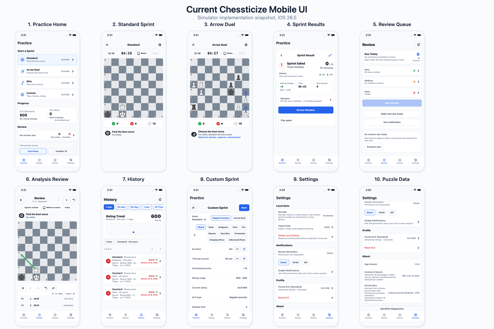
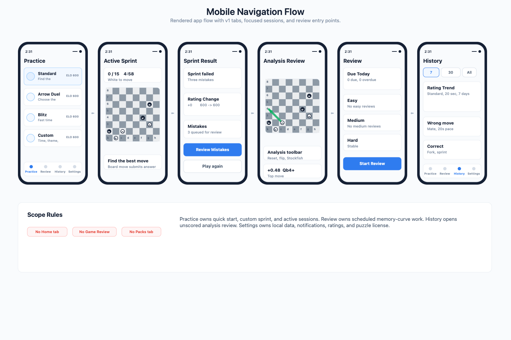
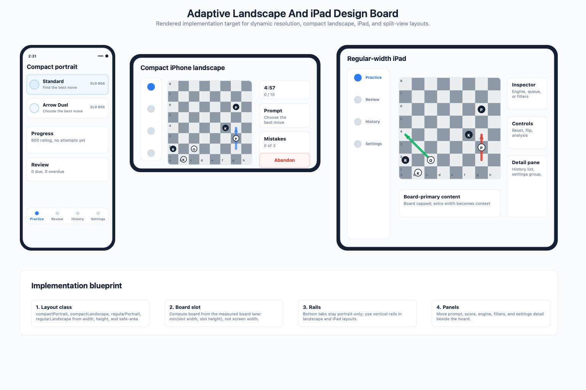
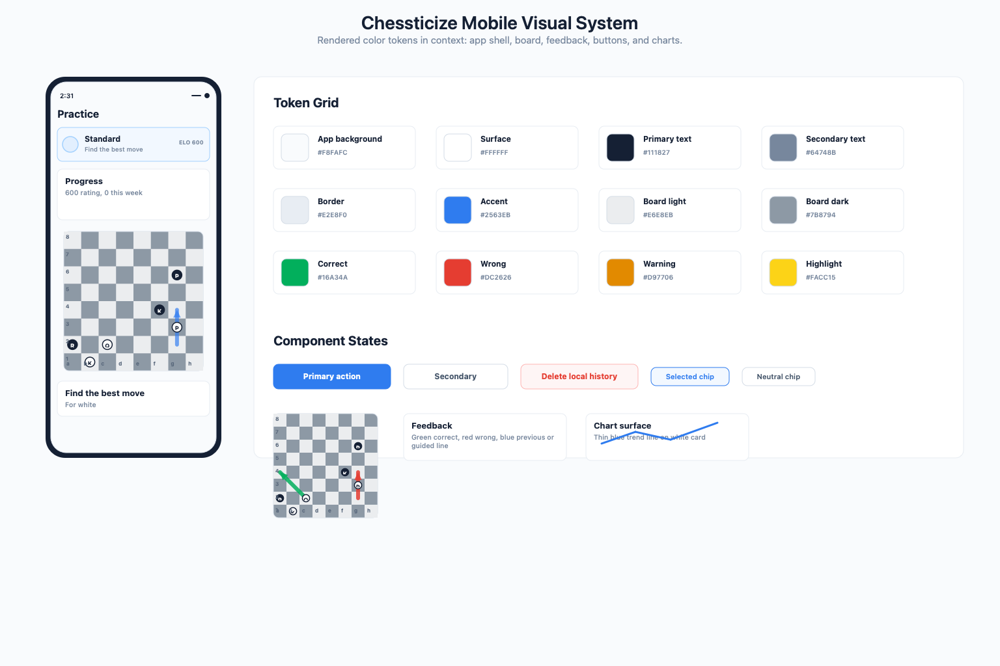
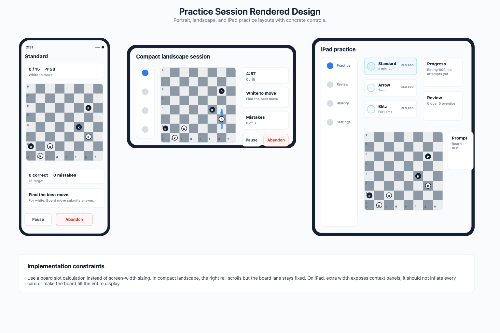
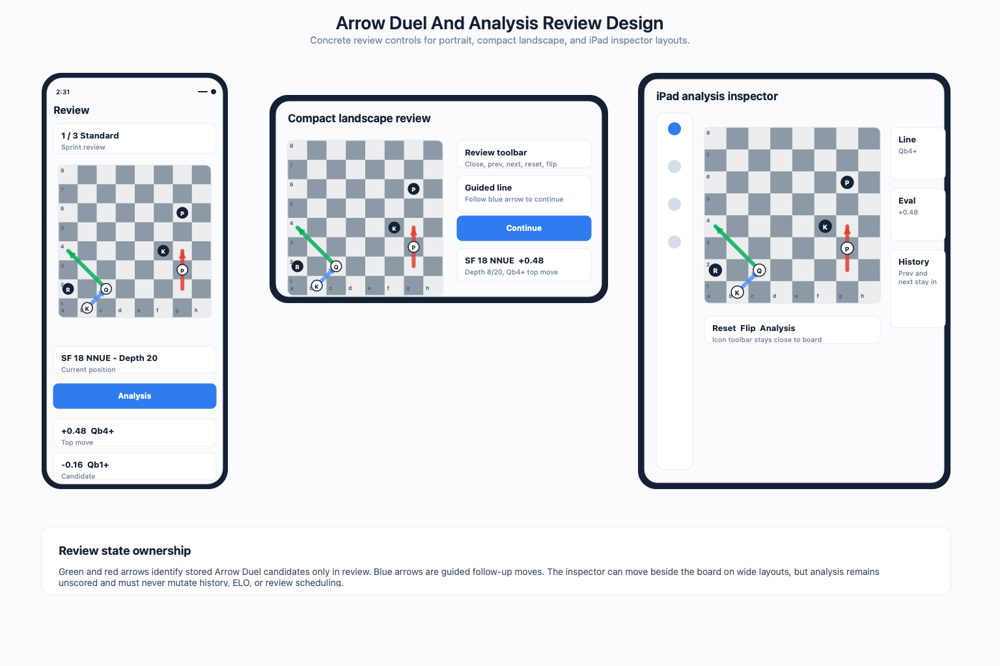
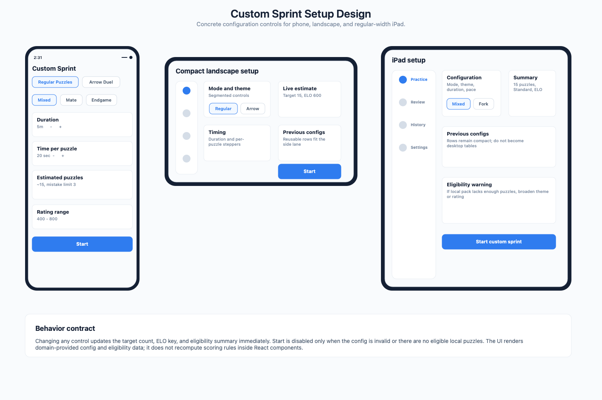

# Mobile UI Design

This document captures the current Chessticize Mobile implementation shape and the remaining mobile-first UI requirements. Game Review is intentionally out of scope for the mobile app.

## Initial Web Reference

- Main navigation includes Home, Puzzle Sprint, Game Review, and Settings. Mobile should exclude Game Review from the app scope.
- Puzzle Sprint dashboard shows daily stats, Standard Sprint, Arrow Duel, recent custom sprint configs, and a Custom Sprint entry.
- Standard Sprint session shows Abandon, success progress, timer, turn prompt, and a large chessboard.
- Arrow Duel session shows Abandon, success progress, timer, a short instruction card, a chessboard, and two candidate arrows.
- Custom Sprint setup includes mode, theme, duration, time per puzzle, editable
  rating, computed puzzle count, and previous custom configs.
- Settings includes chess platform connections and rating editing. Mobile v1 should keep advanced rating management but not prioritize chess.com or Lichess account import.

### Current UI Issues To Avoid

- Desktop navigation and wide centered cards do not translate cleanly to mobile practice.
- The tan/brown board dominates the screen and makes the product feel warmer and heavier than desired.
- Arrow Duel uses decorative emoji in instructional text; mobile should avoid emoji and rely on concise labels and state colors.
- The web dashboard mixes summary stats, mode selection, and recent configs in one broad page. Mobile needs a tighter task-first hierarchy.
- Settings exposes many rating fields as editable inputs. Mobile should prefer explicit advanced adjustment flows and avoid a dense form by default.

## Complete App Design Board

The design board below is a simulator-captured implementation snapshot from the current iOS app. It is useful for reviewing the actual product shape, but the written specifications in this document are authoritative for exact copy, scoring behavior, chart placement, licensing text, and remaining implementation details. The captured build is a development/test build, so it may show QA-only controls such as the puzzle source switch and review notification test actions that must remain hidden in release builds.

All visual design artifacts in this document use PNG renderings. The full design board is captured from the simulator; the other rendered boards are implementation-target mockups that use the same color, spacing, board, control, and device-frame language.

The board covers these current major screens:

- Practice Home
- Standard Sprint Active
- Arrow Duel Active
- Sprint Results
- Review Queue
- Replay
- History
- Custom Sprint Setup
- Settings

Screen inventory:

| Screen | Main layout | Primary actions | Navigates to |
| --- | --- | --- | --- |
| Practice Home | Mode list, progress summary, due review strip, bottom tabs | Start Standard, Arrow Duel, Custom; resume interrupted session | Active Sprint, Custom Sprint, Review Queue |
| Standard Sprint Active | Focused session shell, status bar, board, prompt | Make board move, abandon, complete/fail sprint | Sprint Results |
| Arrow Duel Active | Focused shell, status bar, board, neutral candidate arrows | Choose a candidate on the board, abandon, complete/fail sprint | Sprint Results, Replay |
| Sprint Results | Win/loss status, solved count, rating change, mistakes, actions | Replay attempts, play again, done | Replay, Practice Home |
| Review Queue | Due/overdue summary, difficulty groups, start button | Start due review, filter queue | Review Item |
| Replay | Board, compact toolbar, Stockfish status, candidate line rows, guided arrows when applicable | Reset, flip, analyze, navigate, finish Replay | Sprint Result, History |
| History | All-puzzle attempt list, All/Needs attention selector, conditional rating trend, expandable filters | Switch result scope, refine filters, inspect attempt context, open attempt | Attempt Detail, Review Item |
| Custom Sprint Setup | Mode/theme/timing controls, editable rating, estimate, start | Start sprint, save template | Active Sprint |
| Settings | iCloud Sync, notifications, profile, Help & Feedback, about, puzzle-data source notes | Toggle sync, adjust reminders, contact support, export diagnostics, inspect licenses | External feedback/email/license/source/data links |

## Mobile Information Architecture

Use a four-tab app shell:

- Practice: quick start, active session, custom sprint setup, and Arrow Duel entry.
- Review: due mistake reviews and spaced repetition queue.
- History: attempts, sprint sessions, an All/Needs attention view selector, and
  expandable range, rating-bucket, source, result, review-state, side, and
  theme filters.
- Settings: iCloud Sync, notification preferences, advanced rating adjustment,
  Help & Feedback actions, About links, and puzzle data attribution.

There should be no mobile Home tab, Game Review tab, or Packs tab in v1.

Navigation rules:

- Practice is the default launch tab.
- Active practice sessions hide the tab bar and use a focused session shell.
- Replay and Review reuse the same board-based surface but are distinct activities.
- Replay is the unscored inspection, retry, and analysis surface opened from Sprint Result or History. Review is the official spaced-repetition flow that records Review attempts and updates the queue.
- Settings owns puzzle data source attribution and license notes for the bundled offline puzzle data.
- The app does not expose pack import, removal, or switching controls in v1.

Primary flows:

| Flow | Steps | Notes |
| --- | --- | --- |
| Standard practice | Practice Home -> Standard Sprint Active -> Sprint Results -> Practice Home | Board moves submit answers directly. Win by solving the target count before time/mistake failure. |
| Arrow Duel practice | Practice Home -> Arrow Duel Active -> Sprint Results -> Replay | Candidate arrows are neutral until selection. Win by solving the target count before time/mistake failure. |
| Custom sprint | Practice Home -> Custom Sprint Setup -> Standard Sprint Active or Arrow Duel Active -> Sprint Results | The selected mode determines the active session shell. |
| Due Review | Review Queue -> Review Item -> Review Complete -> Review Queue | Correct answers increase interval; failures reset or shorten it. Official Review attempts are recorded in History. |
| Post-session Replay | Sprint Results or Review Complete -> Replay -> Results or Practice | Used to inspect completed attempts immediately. It is opened only by the result-screen Replay action, does not write History, and does not change the spaced-repetition schedule. |
| History Replay | History -> Filtered row -> Replay | History preserves original attempt context. Previous/next navigation stays inside the active History filter. |
| Progress sync | Settings -> iCloud Sync -> Settings | Progress starts on device; default-enabled iCloud Sync merges ratings, history, and review queue across Apple devices and can be turned off. |

## Design Principles

- Board first: during practice and review, the board is the primary surface and must receive the largest stable area.
- Local-first clarity: in v1, progress starts on device and iCloud Sync must
  present only real transport/account status while remaining user-controllable.
- Calm density: show enough data for repeated training, but avoid desktop dashboards, marketing hero panels, or decorative statistics.
- One-handed portrait first: primary controls should sit below or immediately above the board and remain reachable.
- Adaptive by slot, not by device name: layouts should derive from available width, available height, safe-area insets, and size class rather than from a hard-coded iPhone or iPad model.
- Business state comes from the local backend/domain core. UI screens render view models and dispatch typed intents.
- No hidden scoring changes: UI controls such as hint, skip, undo, or analysis must not appear in scored sprint mode unless the scoring rules explicitly support them.

## Adaptive Layout And Window Shape

The App Store target keeps full-screen iPhone use in portrait, while the
implementation continues to support compact portrait, compact wide-short,
regular-width iPad portrait, regular-width iPad landscape, and iPad split-view
windows. The wide-short class is a window-shape contract for resizable,
mirrored, split-view, and possible foldable environments; it is not a promise
that ordinary full-screen iPhones rotate. Release QA uses native iPhone
portrait and iPad portrait/landscape screenshots, plus component and
Interaction Lab coverage for the remaining window shapes.

Adaptive classes:

| Class | Typical viewport | Navigation | Content rule |
| --- | --- | --- | --- |
| Compact portrait | iPhone portrait, narrow split view | Bottom tab bar when app chrome is visible | Existing one-column scroll. Active sessions hide tabs and stack status, board, score, prompt, and results vertically. |
| Compact landscape | Compact wide-short resizable or mirrored window, short-height split view | Icon rail outside active sessions; no bottom tab bar while playing | Active session uses a board lane plus a right control rail. The control rail owns status, prompt, score, pause/abandon, and overflow scrolling. |
| Regular portrait | iPad portrait, tall large split view | Persistent side rail with labels when width allows, icon-only rail below that | Active practice uses a large board-first vertical flow so the board can grow with the tall screen. Dashboard, history, settings, and review surfaces can still use wider content where useful. |
| Regular landscape | iPad landscape, wide large split view | Persistent side rail with labels when width allows, icon-only rail below that | Use two-pane or three-pane layouts with constrained content width. Active-session controls sit beside the board where space allows. |

Sizing rules:

- Derive layout from `useWindowDimensions()` width and height plus safe-area insets. Width-only board sizing is not enough for landscape because height becomes the limiting axis.
- Board size is computed from the board slot, not from screen width. Use `min(slotWidth, slotHeight)` with a stable minimum and maximum per class.
- Phone portrait board target: fill the content width up to the existing max, while keeping prompt and score visible below the board.
- Compact landscape board target: maximize board height after subtracting top status chrome, bottom/home-indicator inset, and vertical gaps. Cap the board at the compact class maximum and let only the control rail scroll.
- iPad portrait board target: use a large board-first vertical flow capped around 860 pt on full-size iPads, with timer, score, and prompt below the board and still visible without hunting.
- iPad landscape board target: cap at a comfortable inspection size rather than filling the whole display. A 560-640 pt board is usually enough; extra space belongs to analysis, queue, history, or settings detail panels.
- Never scale type with viewport width. Keep platform text sizes stable and let columns, gaps, and panel counts change instead.

Navigation rules:

- Bottom tabs are for compact portrait only.
- Compact landscape uses a narrow vertical rail outside active sessions so navigation does not consume scarce height.
- Regular width uses a persistent side rail. At wider iPad sizes, show icon plus text labels; at narrower split-view widths, collapse to icon-only.
- Active practice and review sessions hide global navigation in every class. The exit/close affordance remains in the session header or control rail.

Safe-area rules:

- No board, tab, rail, or primary control may sit under the Dynamic Island, camera cutout, rounded-corner exclusion, or home indicator.
- In compact landscape, prefer left or right rails that can absorb notch/camera safe area without compressing the board.
- Keep 44 x 44 pt minimum hit targets after safe-area padding is applied.
- Panels that overflow in landscape should scroll internally; the board itself must not be pushed off-screen by long prompt, engine, or review text.

### Adaptive Practice And Review

Practice Home:

- Compact portrait keeps the current task-first list.
- Compact landscape shows a left navigation rail plus a two-column content area: mode shortcuts and progress/review summary. Avoid a wide desktop dashboard.
- Regular width uses two columns: primary practice modes on the left, progress/review/resume cards on the right. Keep the active "Start" affordance close to the mode row.

Active Sprint:

- Compact portrait keeps the current vertical stack.
- Compact landscape and iPad landscape use board lane plus control rail. The board lane contains the board and any board-adjacent status. The control rail contains timer, progress, mistakes, side-to-move, prompt, pause, and abandon confirmation.
- iPad portrait uses the same vertical task order as phone portrait, but with a larger capped board and wider supporting rows.
- The entire board must remain inside the safe-area shell and keep the same `x`, `y`, `width`, and `height` before, during, and after correct or wrong move feedback. Score changes, feedback overlays, and the Unclear action must never shift or resize it.
- Place the Unclear action after the board and score in portrait. In landscape, place it at the bottom of a board-height control rail; overflow belongs to that rail, not the board lane.
- The prompt must not appear below the fold in landscape. If the prompt plus actions overflow, the control rail scrolls independently while the board remains fixed.
- Arrow Duel candidate arrows stay on the board in every class. Do not move candidate selection into separate landscape buttons.

Replay:

- Compact portrait keeps board above the analysis toolbar and line list.
- Compact landscape puts the board in the larger lane and the analysis/guided-line panel in the control rail.
- Regular width uses board plus inspector. The inspector can hold analysis controls, engine status, candidate rows, and the Continue action without covering the board.
- History-launched Replay should preserve previous/next navigation in the header or inspector, not in a bottom toolbar.

History:

- Compact portrait keeps the All/Needs attention selector, applied-filter
  summary, optional trend, and attempt rows stacked. Detailed controls stay in
  the expandable filter menu.
- Compact landscape and regular width can use a split view: filters and chart on one side, attempt list/detail on the other.
- Regular-width attempt detail may open beside the list rather than replacing the full screen, but Replay still owns the full board surface when launched.

Settings:

- Compact portrait keeps the current stacked settings groups.
- Compact landscape and iPad regular width can use a master/detail settings layout: groups on the left, selected group detail on the right.
- Destructive confirmations remain modal or sheet-based and must not become small inline controls in wide layouts.

Implementation notes:

- Keep the adaptive layout model (`compactPortrait`, `compactLandscape`, `regularPortrait`, and `regularLandscape`) derived from measured width, height, and safe-area insets.
- Keep board sizing tied to the available board slot rather than screen width alone, shared by active sprint and review.
- Keep view models and domain behavior unchanged; adaptive layout should only change rendering, navigation placement, and panel composition.
- Keep iOS orientation/device-target configuration aligned with component coverage and simulator screenshot QA.

## Visual Direction

The mobile UI should feel like a quiet training tool, not a marketing page.

Color tokens:

- App background: `#F8FAFC`
- Surface: `#FFFFFF`
- Primary text: `#111827`
- Secondary text: `#64748B`
- Border: `#E2E8F0`
- Accent: `#2563EB`
- Board light square: `#E6E8EB`
- Board dark square: `#7B8794`
- Correct: `#16A34A`
- Wrong: `#DC2626`
- Warning: `#D97706`
- Highlight: `#FACC15`

Style rules:

- No gradients, decorative blobs, or emoji.
- Use cards only for repeated list items, modals, and framed tools.
- Avoid nested cards.
- Keep controls stable in height and width to prevent layout shift during timers and progress changes.
- Use icons only where they reduce text, with accessible labels.
- Board and timer areas should be optimized for one-handed portrait use.

Typography:

- Use the platform system font.
- Screen title: 22-24 pt, semibold.
- Section title: 16-18 pt, semibold.
- Body text: 15-16 pt.
- Metadata and helper text: 12-13 pt.
- Timer text: tabular numerals, 18-22 pt depending on surface.

Spacing and shape:

- Base spacing unit: 4 px.
- Screen horizontal padding: 16 px on phones.
- Component gap: 8, 12, or 16 px.
- Cards and sheets: 8 px radius unless native platform controls require otherwise.
- Board radius: 6-8 px, never a floating decorative card inside another card.
- Hit target minimum: 44 x 44 px.

Core components:

- `SessionStatusBar`: mode, rating, progress, timer, mistakes, pause/abandon affordance.
- `ChessboardSurface`: reused board component plus highlight/arrow overlay adapter.
- `ModePicker`: compact list or segmented choice for Standard, Arrow Duel, Custom.
- `ReviewQueueHeader`: due count, overdue count, and next review estimate.
- `HistoryFilterBar`: persistent All/Needs attention segmented view, compact
  filter toggle, applied-filter summary, and expandable range, rating,
  result/source, review-state, side, and theme filters.
- `RatingTrendChart`: rating-only line chart over the selected rating bucket and
  time range; hidden in the default All Puzzles view.
- `SettingsRow`: label, value, status, and disclosure or switch.
- `SettingsExternalLinkRow`: label, short value, readable detail, and a
  tappable link target without compressing the primary copy on phone widths.
- `AboutLinkRows`: separate external rows for License, Source, Stockfish, and
  Puzzle Data.

## Core Screen Drafts

### Practice Session

Practice session layout:

- Top session bar: mode, rating, progress, timer, mistakes, and exit.
- Board gets most of the screen and remains visually stable.
- Prompt and action area live below the board.
- Regular puzzles use board moves as the primary input.
- Arrow Duel uses board arrows as the only candidate input. Do not show separate A/B choice chips below the board.
- Board coordinates should be visible enough for review/debug discussion without competing with pieces, arrows, or feedback highlights.

Practice session states:

- Loading: skeleton session bar plus reserved board space. Do not shift layout when the puzzle appears.
- Ready: board interactive, prompt visible, timer running.
- Correct move: brief green confirmation, advance automatically after a short delay.
- Wrong move: red feedback, attempt is recorded, review scheduling happens in the backend/domain core.
- Sprint complete: summary sheet with rating change, accuracy, time, mistakes, and review queue impact.
- Sprint failed: summary sheet with failure reason and a retry action.
- Paused/backgrounded: timer paused only according to domain rules; UI must show paused state explicitly.

Board input rules:

- The user can drag only their own side-to-move pieces while the board is unlocked.
- Opponent pieces are never draggable by user input.
- The board locks immediately after a submitted move and stays locked while the app validates the move, applies feedback, and plays any opponent reply animation.
- Premove is not part of the current UX. Input during a locked board state is ignored.
- Illegal moves and legal moves that are not accepted by the active puzzle state revert visually and do not mutate the domain state.
- Valid move indicators remain available for selectable own pieces.
- Correct feedback uses green cell highlights; wrong feedback uses red cell highlights; opponent or previous-line movement uses blue only when the user is not in an immediate correct/wrong feedback state.
- Feedback cell highlights do not need borders. Avoid stacking blue last-move highlights over green or red feedback.

Sprint scoring rules:

- Standard Sprint default: 5 minutes, 20 seconds per puzzle, target 15 correct puzzles.
- Arrow Duel default: 5 minutes, 30 seconds per puzzle, target 10 correct puzzles.
- Custom Sprint target count is `floor(durationSeconds / perPuzzleSeconds)`.
- A sprint is won only when the target correct count is reached before time expires and before mistake failure.
- A sprint is failed when time expires, the user abandons, or the user reaches 3 mistakes.
- Winning a sprint increases that sprint rating.
- Failing a sprint lowers that sprint rating.
- Abandoning after the first submitted move, whether that move was correct or wrong, is a failed rated run and lowers that sprint rating. Abandoning before any submitted move remains an unrated cancel.
- Each sprint mode and custom speed has its own rating/statistics bucket.
- A manual rating edit starts a new rating generation, clears the rated-game count,
  caps rating deviation at 100 without increasing an already lower value, and
  preserves volatility. This treats the chosen rating as a deliberate difficulty
  anchor while allowing later sprints to recalibrate it.

Practice controls:

- No default Hint button in scored sprint mode.
- No default Skip button in scored sprint mode.
- No Submit button for regular board moves; the move itself is the submission.
- Abandon is present but secondary and requires confirmation.
- Analysis is available after the attempt/session, not during a scored puzzle unless the mode is explicitly non-scored.

Developer/test-build controls:

- Test builds may expose a puzzle source switch for manual QA.
- The Core Pack source should start each sprint with a fresh puzzle-selection seed so manual QA sees a random batch from the offline pack.
- The familiar fixed set is for deterministic regression testing and quick simulator repros. It intentionally keeps a stable order instead of using the random seed.
- The familiar fixed set should include stable edge cases such as a promotion puzzle.
- Do not expose the old Random 1000 source in the manual test-build switch; large regression fixtures may remain internal automated-test inputs only.
- Special fixtures may be added temporarily for focused bugs, but should not become the default familiar set unless they are stable regression samples.
- The puzzle source switch must be hidden in release builds.

### Arrow Duel Replay And Review

Arrow Duel Replay behavior:

- The colored candidate arrows render in Analysis mode at the puzzle's initial position: correct Stockfish best move is green, the blunder or inferior candidate is red.
- The review surface does not show separate color-legend or "You chose" chips. The board arrows and guided punishment-line state carry the context.
- If the user chose wrong, automatically play the opponent response or punishment line.
- Prefer stored puzzle solution lines for explanation; fall back to local Stockfish when the stored line is not enough.
- While the punishment line is being replayed, show the current-position evaluation, not the original candidate evals.
- If the punishment line reaches checkmate, show the game result (`1-0` or `0-1`) and "Checkmate".
- The user can switch to analysis at any point. Analysis mode uses Stockfish, shows candidate lines, and does not mutate official review history.
- A wrong Arrow Duel review stays on the same puzzle after the punishment line. It must not auto-advance to the next review puzzle.

Arrow Duel active-session rules:

- Candidate arrows are neutral before selection.
- Candidate ordering is randomized by backend/domain logic and stored with the attempt.
- The board must not reveal which move is best before selection.

Arrow Duel Replay and Review rules:

- Replay and Review reconstruction must reuse the candidate order stored on the original attempt. Neither may generate a fresh default order for History, post-Sprint Replay, or Review.
- Green always means the best move.
- Red always means the inferior candidate.
- The review should avoid redundant legend or choice-marker chips; use board arrows, feedback highlights, and the guided line to explain the state.
- After a wrong answer, the opponent's refutation reply plays automatically, then the punishment line continues as a guided interaction: the user plays each expected move themselves by following the guide arrow, so no pause/step transport controls are needed. Replay is available by resetting the puzzle. Throughout the line, show the live Stockfish evaluation of the current position. The current implementation uses the compact review toolbar and guided arrows rather than a playback transport bar.
- If the stored punishment line requires the user's next move, show that expected move with an arrow, wait for the user to make it, then play the next reply. Continue until the line ends, then stop.
- Review copy should explain the tactical reason only when the data supports it; otherwise show engine line and evaluation shift.
- In Review, selecting the wrong Arrow Duel candidate records a failed Review attempt and resets or contracts that puzzle's schedule. The user may then enter Replay to inspect the line without creating additional history.

### Replay

- The page title and every Sprint Result or History entry CTA use `Replay`, never `Review`.
- Replay does not create attempts, change ELO, or advance or reset a Review Schedule.
- Post-Sprint Replay contains the union presented on Sprint Result. Two Unclear attempts plus two distinct In Review attempts produce four Replay entries.
- Replay does not add new status badges. An Unclear entry exposes `Mark clear`; an In Review entry exposes `Remove from Review`.

Replay is the shared unscored board surface opened from Sprint Result, Review results, and History.

Toolbar:

- Put close, previous, next, reset, flip, and Analysis controls on one compact row.
- Use icon buttons for navigation and board actions.
- The Analysis button should be visually prominent enough to scan quickly and should use the label "Analysis".
- When Stockfish is running, show engine status in compact form, for example `SF 18 NNUE · Depth 8/20`.

Engine line list:

- Candidate rows are compact single-line rows.
- Put the evaluation at the start of each row, then the row number and SAN move, then the label such as `Top move` or `Candidate`.
- Every live Stockfish row should have an engine evaluation. Do not fill the list with unscored legal moves.
- Rows are tappable. Tapping a row makes that move on the analysis board, adds the previous position to the back stack, clears the forward stack, and starts fresh analysis from the new position.
- The row order and eval values may change as Stockfish searches deeper. The UI should stream updates rather than wait for final depth.
- Back, forward, and reset affect only the analysis board and never create History rows, review attempts, rating changes, or review schedule updates.
- Reset returns to the puzzle's initial review position, not the current Stockfish line's start if the user has navigated away.

Terminal and guided-line states:

- If the current analysis/review position is checkmate, show the game result (`1-0` or `0-1`) instead of misleading candidate rows.
- During Arrow Duel wrong-line playback, any eval shown under the board describes the current position. It must not reuse the original two candidate scores after the board has advanced.

### New Run Setup

New Run layout:

- Use a focused New Run screen or bottom sheet rather than a desktop-style page.
- Keep name, practice format, themes, duration, and per-puzzle time as compact controls.
- Show computed puzzle count and rating as a live summary.
- Saving creates a persistent named Run on Practice Home and does not start a Sprint.
- Do not show a separate Previous configs list. During the schema v8 upgrade,
  promote every legacy Previous config into a visible named Home Run in its
  existing last-used order. Number Regular Puzzle and Arrow Duel names
  independently, preserve the legacy rating key, rating, themes, timing, and
  History grouping, and keep the old config row for a non-destructive,
  idempotent migration.

New Run controls:

- Name: required, unique across active and removed Runs, and limited to 40 characters.
- Practice format: Regular Puzzles or Arrow Duel.
- Themes: All or any combination of supported curated tactical themes; multiple
  themes use OR eligibility.
- Duration: use allowed sprint durations from the domain config.
- Per-puzzle time: use allowed per-puzzle times from the domain config.
- Rating: default to 600 for unplayed custom buckets. Show the `Starting rating`
  stepper directly before play. After play, replace it with a collapsed
  `Edit rating` disclosure row so changing an established rating remains possible
  but is not presented as a routine action.
- Max mistakes: default from domain config; do not expose in the current Custom
  Sprint setup.
- Summary: target puzzle count only; avoid repeating mode, rating range, current
  rating bucket, or mistake limit as non-editable rows.

New Run behavior:

- Changing any control updates the summary immediately.
- Add to Home is disabled only when the Run is invalid or no eligible puzzles exist locally.
- Once a Run has rated games, its current rating remains editable from that Run's
  editor without changing its stable Run identity or History linkage.
- If the selected puzzle pack lacks enough eligible puzzles, show a local pack
  warning and offer a broader theme.

## Screen-Level Requirements

### Practice

- Default entry opens Practice, not a landing page.
- Practice Home lists persistent named Runs, including the built-in Standard and
  Arrow Duel Runs, plus a separate Add Run action.
- Current rating appears on each Run and is edited from that Run's editor rather
  than from a separate Settings rating surface.
- The active session should remain readable at small phone widths.
- The active session should remain playable in compact landscape without requiring vertical scrolling of the board lane.
- On iPad, Practice should use available width to expose progress and due-review context beside mode choices, not by enlarging every card.
- Abandon must be visible but visually secondary.
- If a session was interrupted, Practice should offer Resume before Start New.

### Review

- The Review tab is for official spaced-repetition Review, not Replay or free analysis.
- First screen shows due mistake count and starts the official review flow.
- Filters include due, overdue, failed again, mode, sprint speed, and Arrow Duel only.
- Review should reuse the same board surface as Practice.
- Review should use the same adaptive board-slot sizing as active sprint, with Review controls moving into the side/control rail in landscape and regular-width layouts.
- Standard review items use the original puzzle-solving flow and preserve the relevant target pace, such as a 20-second item from a 20-second sprint. Legacy Blitz history may still be displayed for compatibility, but Blitz is no longer a current mobile practice entry.
- Arrow Duel review items use the Arrow Duel choice flow.
- Correct reviews advance through 1, 3, 7, 14, 30, and 60 calendar-day
  intervals. Failed scheduled reviews reset to the next review day.
- Every Sprint mistake, whether a submitted wrong move or a timeout without a submitted move, creates a Review queue item but is not itself a Review-time lapse. Queue items start with `lapseCount = 0`; failed Review attempts increment lapses; successful Review attempts reduce lapses toward zero.
- The "Failed again" filter matches review-time lapses only. It must not match every item that originated from a sprint mistake.
- Due and overdue are different calendar-day states. A review is due when
  `dueDay <= today` and overdue when `dueDay < today`. The local review day
  rolls over at 04:00. Practice badges, Review summaries, filters, and queue
  rows must all use this shared core definition.
- Empty state should say when the next review is due and offer regular practice.
- Review cards should show mode, last wrong date, due state, current interval, and source sprint type. They must not expose puzzle tags.
- The default Review Queue surface shows Today, Tomorrow, Next 7 days, and
  Total workload counts; per-item review cards and grouped starts appear in the
  expanded filter view. Overdue appears only when the count is nonzero.
- Review queue counts include only locally resolvable puzzles. If a queue row references a puzzle that is no longer available in the active local pack, the backend removes that row before the UI computes due, overdue, and total counts.
- The user can stop a Review session at any time. Completed items are saved; unseen items remain due or overdue.
- Review and Replay hide puzzle tags while the user is solving so that tags cannot act as hints. The complete server-curated tag set appears only while Analysis is active and disappears again when Analysis closes.
- After a Review batch, the user may open Replay for missed items. That follow-up inspection does not create history rows and does not update the schedule.
- Post-Sprint Replay is also unrecorded. It is for same-day exploration only; Review still starts from the stored due date, normally the next day after the miss.
- Post-Sprint Replay contains the attempts selected by the Sprint Result summary. If the user leaves the result screen, starts another Sprint, or exits that Replay, the Review tab must show only the Review queue and must not auto-start those session attempts again.

### History

- The only persistent History view selector is a compact, single-select
  `Needs attention / All` segmented control. History opens with
  `Needs attention` selected.
- History data must be pageable, including the all-time range.
- `Needs attention` is backed by two visible Attention reasons: `Unclear` and
  `In review`. The reasons combine with OR, and both are selected by default.
  Any attempt represented by an active Review Schedule qualifies as
  `In review`, including a clean correct attempt enrolled manually.
  Clearing Unclear or removing the matching Review entry removes the attempt
  from this view when no other attention state remains.
- A correct attempt that reaches the Slow threshold is automatically marked
  Unclear. Instead of the follow-up question, the Sprint surface shows a
  non-actionable notice explaining that the attempt was marked because it was
  Slow. Only correct Sprint attempts can be marked Unclear. Wrong and Timed out
  attempts are mistakes, are added to Review, and are not also marked Unclear.
- Slow and Timed out remain visible attempt labels. They are not History filter
  options. A Slow label does not independently keep an attempt in Needs
  attention after its Unclear marker is cleared; a Timed out attempt remains
  there through its active Review entry.
- Source defaults to All sources rather than Sprint.
- Time range, rating bucket, source, result, Attention, side, and theme controls
  live behind the compact filter toggle. Attention contains only `Unclear` and
  `In review`; there is no separate Review queue facet. No separate Sprint,
  Wrong, Unclear, Slow, or Timed out quick control remains.
- Every advanced facet combines with the selected History view using AND. Keep
  the result count and category/value applied-filter summary near the list.
  Multiple selected Attention reasons combine with OR inside that facet.
- Selecting either Attention reason keeps `Needs attention` active. Clearing
  both switches the primary selector to `All`; selecting `Needs attention`
  from `All` restores both reasons.
- `Timed out` remains a distinct History result and label, but it counts as a
  Sprint mistake for the mistake limit and failed-Run ELO outcome, and creates
  the same Review Schedule as a submitted wrong move. The `Wrong` result
  filter includes Timed out attempts.
- Reset restores `Needs attention`, both Attention reasons, All sources, and
  the default range.
- Keep the full Themes facet collapsed when the History filter menu opens.
  Its disclosure names the selected themes in one ellipsized line before
  expanding. In the applied-filter summary below the view selector, show the
  theme name for one selection or `{n} themes selected` for multiple
  selections, including `24 themes selected` when every named theme is checked.
- Place the expanded advanced-filter region in one bordered container above
  `Needs attention / All`. Keep Themes visually lightweight inside that
  container, without its own full-width card border or background.
- Selecting a rating bucket supplies the mode, sprint config, and sprint-speed
  context for rating history. Do not show separate History mode or speed chips
  while the view can be focused through rating bucket chips.
- Source type distinguishes Sprint attempts from official Review attempts.
- History includes correct and wrong sprint attempts.
- History includes correct and wrong Review attempts.
- History excludes Replay exploration and retry moves.
- Each row should show result, source type, mode, puzzle rating, elapsed time, date, and review status.
- Row review status and difficulty must be resolved by the full attempt context
  (`puzzleId + mode + ratingKey`), not by `puzzleId` alone. The same puzzle can
  appear in multiple sprint modes or rating buckets, and a queued review date from
  one bucket must never appear on another bucket's row.
- Tapping a row opens Replay with original attempt context.
- Replay launched from History supports retry, Stockfish analysis, and previous/next navigation through the current filtered History result set.
- Previous/next navigation from History follows the active filter result order, not just the currently visible page.
- Expanded History menu filters may use horizontally scrollable chip groups on
  phones. The persistent `Needs attention / All` selector itself must fit
  without horizontal scrolling.
- History theme filters use multi-select OR semantics: an attempt matches when
  it has any selected curated theme. `All` represents no named-theme constraint,
  clears named selections, and is restored when the last named theme is removed.
- History rows and theme filters show only server-curated theme tags. Rows show
  the complete curated set for the puzzle rather than only the first raw
  metadata tag. A History replay hides tags while solving and reveals the same
  complete curated set only while Analysis is active.
- On regular-width iPad, History may use a split view for filters/chart/list,
  but the default list remains All Puzzles and the trend chart appears only
  after a rating bucket is selected.
- Failed attempts should clearly show whether they are already in the review queue.
- The rating trend chart belongs in History, not primarily in Sprint Results.
- History must show only the selected rating bucket's rating trend as a line chart
  connecting rating-change points. Do not show a rating trend in the default All
  Puzzles view.
- Do not show alternate History performance chart modes such as wins/losses, accuracy, solved count, mistake rate, or review due volume.
- The rating trend chart series uses the full filtered time range.
  Pagination affects only the visible attempt rows, never the chart inputs.
- The rating trend chart intentionally ignores the correct/wrong result filter. That filter is for narrowing attempt rows, not for redefining the rating series.
- Statistics are grouped separately by the selected rating bucket for Standard,
  legacy Blitz data, Arrow Duel, theme sprint, and custom sprint speeds.
- Mistake statistics are also grouped separately by sprint type, speed, theme, and review state.

### Sprint Results

- Results should stay action-oriented and compact.
- Show win/loss, reason, solved count, Unclear count, In Review count, time, best streak, rating before/after, rating delta, Play Again, and the applicable Replay action.
- Do not make the rating performance chart the main result view; link to History for deeper trend analysis.

### Settings

- iCloud Sync appears near the top. It defaults on, shows the real enabled state
  and current account/sync status, and exposes a manual Sync Now action while
  sync is enabled.
- Help & Feedback keeps three support entries in this order: GitHub feedback,
  `Export Support Diagnostics`, then Email Support as the final row.
  Diagnostics remain available even when
  sync is off and no error is visible. Export requires confirmation before
  preparing a package and identifies sensitive progress content. iOS includes a
  consistent local SQLite snapshot and the private CloudKit JSON snapshot when
  available. Android includes the consistent local SQLite snapshot without
  claiming that an iCloud snapshot exists. Both platforms add bounded
  diagnostic and manifest files with database health and checksums. iOS removes
  a shared bundle when its Share Sheet closes. Android refuses new reads from
  its private share URI after one hour, revokes URI access during best-effort
  cleanup, and deletes the cached copy at the next available cleanup opportunity;
  a recipient may retain any copy it already chose to save. Closing the
  diagnostics window discards unshared files.
- A visible sync failure adds `View Error Details`, including bounded technical
  fields and a copy action. It must not expose raw native metadata that can
  contain credentials or account identifiers.
- On regular-width iPad, Settings should use grouped navigation plus a detail panel; do not make each settings row stretch across the full display.
- Rating difficulty controls should be hidden behind an `Edit rating` row to keep the
  default Settings surface compact.
- Settings must not expose incomplete local data actions. Do not show local
  storage copy, export, local-history deletion, or rating-reset rows unless a
  complete user-facing workflow is implemented.
- Settings must not include simulated cloud state in v1: no upload approval
  prompt and no fabricated "last synced" timestamp. Sync controls must be
  backed by the CloudKit transport, entitlement, merge engine, and truthful UI
  state.
- About must use separate readable link rows for License, Source, Stockfish,
  and Puzzle Data. License opens the repository license file, Source
  opens the public repository, Stockfish opens the embedded Stockfish engine
  source in the repository, and Puzzle Data opens the Lichess puzzle database.
- Help & Feedback keeps diagnostics and Email Support next to the
  privacy-bounded GitHub feedback entry, with Email Support always last. Email
  Support opens `support@chessticize.com`.
- On phone widths, About rows must leave enough horizontal room for label,
  detail, and link text. Keep right-side values short and do not combine
  multiple unrelated links into one row.

### Review Reminder Notifications

Daily local notifications remind the user when scheduled reviews are due. No
push infrastructure: everything is computed on device from the local review
queue.

Scheduling rules:

- At most one reminder per day, and only when at least one review item will be
  due at the reminder time. Zero due items means no notification.
- The reminder time defaults to a smart time: the hour the user most often
  trains, derived from local attempt history (median session start hour over
  the trailing 14 days, minimum 5 sessions). Until enough history exists, fall
  back to 19:00 local time.
- The user can override the smart default with a fixed time, or disable
  reminders entirely, from a Notifications section in Settings.
- The notification copy includes the due count, for example "12 reviews are
  ready". Tapping it opens the Review tab.
- The next reminder is (re)scheduled whenever the review queue changes and when
  the app backgrounds, using the projected due count at the reminder time
  (computable locally from stored `dueDay` values).

Permission flow:

- Do not request notification permission at first launch. Ask contextually:
  after the first review session completes (value already demonstrated), offer
  enabling reminders with a one-line explanation, then trigger the iOS
  permission prompt.
- If permission is denied, the Settings row shows the disabled state with a
  link to system settings. Never re-prompt automatically.

Architecture:

- The decision "what reminder should be scheduled next" (time, due-count copy,
  or none) is computed in the domain core from the review queue, usage
  history, and notification settings, and is unit-testable in Node.
- The platform notification API (UNUserNotificationCenter) sits behind an
  interface with a maintained fake, matching the repo boundary rules.
- In dev/test builds only, the Review tab may expose controls to promote the next future due review date to today and to schedule a short-delay test notification. These controls must call the same storage and notification scheduler interfaces used by production code and must not appear in release builds.

### Puzzle Data Attribution

V1 ships bundled offline puzzle data only. Pack downloading, import, removal,
and switching are out of scope, so there is no Packs tab in the app shell.
Puzzle data source and license notes live in Settings.

- Settings must state that the bundled puzzle data is derived from the Lichess puzzle database and includes Chessticize presolve metadata.
- Settings must show the source license from the bundled manifest.
- Settings must link to `https://database.lichess.org/#puzzles`.

## Accessibility And Automation Contracts

Every screen must expose stable accessibility labels and test IDs for Detox.

Required labels/test IDs:

- `practice-tab`
- `review-tab`
- `history-tab`
- `settings-tab`
- `practice-mode-standard`
- `practice-mode-arrow-duel`
- `practice-mode-custom`
- `session-board`
- `session-timer`
- `session-progress`
- `session-mistakes`
- `session-abandon`
- `review-start-due`
- `review-dev-promote-next-due` (dev/test builds only)
- `review-dev-test-notification` (dev/test builds only)
- `history-filter-toggle`
- `history-filter-wrong-only`
- `settings-license`
- `settings-source`
- `settings-stockfish-source`
- `settings-puzzle-data-license`
- `settings-support-email`
- `adaptive-layout-root`
- `primary-navigation-rail`
- `session-control-rail`
- `analysis-side-panel`

Accessibility rules:

- Do not rely on color alone for correct/wrong states.
- Dynamic timer changes must not spam screen readers.
- Board coordinates and selected squares need accessible descriptions in review mode.
- Support contact information must be readable as text, not only as an icon.

## Testing Implications

- Every core screen must expose stable accessibility labels for Detox.
- Component tests should verify user-visible behavior, not component internals.
- UI should receive view models from backend/domain packages; React components must not compute sprint outcomes, rating updates, review scheduling, or Arrow Duel correctness.
- E2E flows should cover Practice start, Arrow Duel choice, wrong-answer review, custom sprint setup, history filtering, Settings iCloud Sync, and About link attribution.
- Design QA should include iPhone SE-sized portrait, modern iPhone portrait,
  compact wide-short and foldable-sized windows, iPad portrait, iPad landscape,
  and iPad split-view widths.
- Adaptive component tests should render the app shell with explicit width/height pairs and assert chrome placement, board sizing, rail visibility, and absence of overlapping controls.
- Simulator screenshot QA should keep iPhones in portrait and use an iPad for
  landscape and resizable native evidence. It should include at least one
  active Sprint, one Arrow Duel state, one Replay state, and one
  History/Settings regular-width state before App Store submission.
- E2E assertions should target stable labels/test IDs from this document.

## Open Design Questions

- Whether custom max mistakes is part of v1 custom sprint or should remain fixed by scoring mode.
- Whether regular-width iPad navigation should always show text labels or collapse to icon-only in smaller split-view widths.
